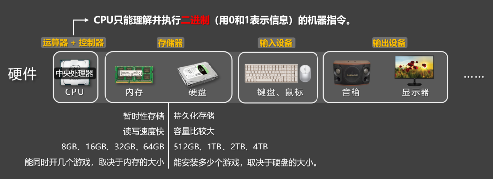
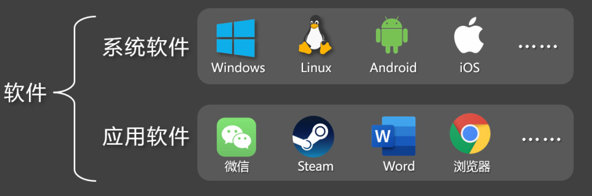

# 1. 计算机组成

## 1.1. 硬件

计算机硬件主要由五个部分组成，分别是：运算器、控制器、存储器、输入设备、输出设备。

📋备注 :『运算器』和『控制器』一起组成了中央处理器（CPU）。

计算机硬件

📢注意：计算机的 CPU 只能理解并执行二进制（用 0和1表示信息）的机器指令。

内存 VS 硬盘：

硬盘：持久化存储，读写速度不如内存快，但容量通常比较大（500GB、1TB、2TB 等）。

内存：暂时性存储，读写速度快，但容量通常不如硬盘大（8GB、16GB、32GB、64GB 等）。

通俗理解：能安装多少个游戏，取决于硬盘的大小；能同时开几个游戏，取决于内存的大小。

| 运算器 | 运算器（简称：ALU），专门负责执行各种『算术运算』和『逻辑运算』，它需要与控制单元、寄存器等紧密配合。 |
| --- | --- |
| 控制器 | 计算机的控制中心，它指挥计算机各部分协调地工作，保证计算机按照预先规定的任务，有条不紊地进行操作及处理。 |
| 存储器 | 计算机中的“资料库”，它既保存程序指令，又保存数据，各个硬件在需要访问或更新数据时，都会与它打交道，有了存储器，计算机才有“记忆”。 |
| 输入设备 | 向计算机输入数据和信息的设备，是计算机与外界通信的桥梁。 |
| 输出设备 | 用于输出计算机执行任务的结果，把各种结果数据或信息以：数字、字符、图像、声音等形式表示出来。 |

## 1.2. 软件

计算机软件主要分为：系统软件、应用软件。

计算机软件

| 系统软件 | 直接管理和控制计算机硬件的软件，为应用软件提供运行平台，它负责协调硬件资源（如内存、处理器）并提供通用服务，例如：文件管理、设备控制、任务调度。 |
| --- | --- |
| 应用软件 | 用于执行特定任务的软件，满足用户的具体需求，如：文档编辑、数据分析、娱乐等，它依赖系统软件提供的资源和服务。 |
