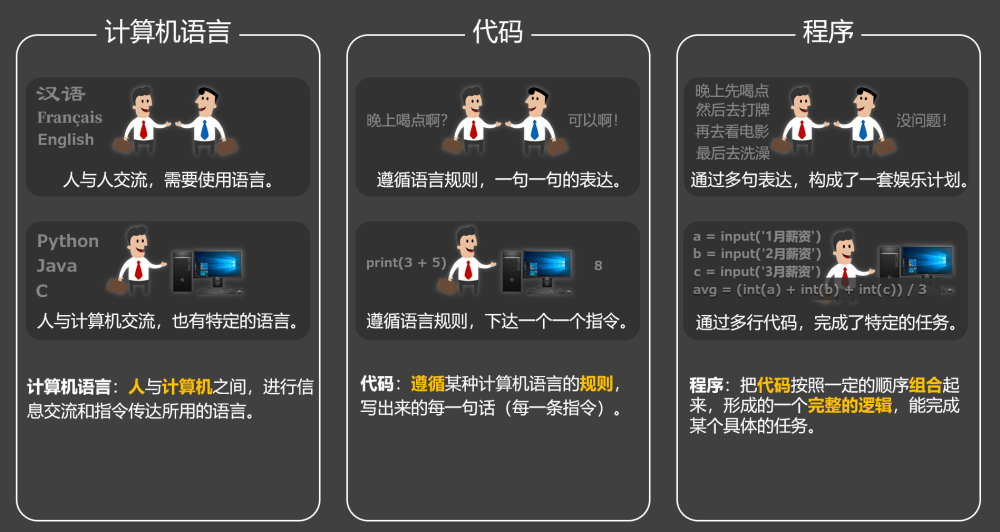

# 2. 计算机语言、代码、程序

计算机语言、代码、程序

## 2.1. 计算机语言

计算机语言是人类与计算机进行『交互』和『指令传达』所使用的一种形式化语言。比如：人与人之间，需要使用各种语言进行交流，那人与计算机之间，同样也需要语言进行沟通。

## 2.2. 代码

代码是在计算机语言规则的约束下，编写出来的一组指令，具体描述了要让计算机去执行的操作。简言之就是：计算机语言是规则，代码是基于这些规则，所编写出来的一行一行的指令。

## 2.3. 程序

代码按照特定的顺序和逻辑组合后，就是程序；程序通常用于完成某种特定的任务或功能。如果说程序是一道菜，那代码就是做这道菜的某个步骤。
