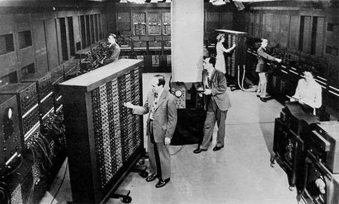
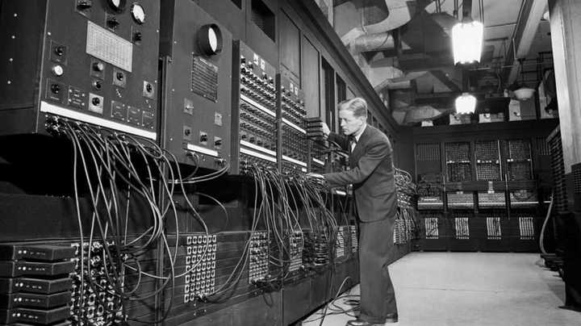

# 3. 计算机语言简史

## 3.1. 第一代语言：机器语言

计算机问世的初期，人们只能通过『机器语言』（又称机器码）来操作计算机，所谓机器语言，就是0和 1组成的二进制内容。而且在当时，录入和修改信息通常都需要：拨动开关、或插拔连线、或使用打孔纸带来输入指令。



世界第一台计算机



世界第一台计算机

机器语言虽然能充分利用硬件性能，但所有操作都必须通过二进制来完成，所以编程的过程极为繁琐，且容易出错，对程序员的理解能力和耐心，都要求极高。

例如：在x86的 CPU 架构下，使用机器码编写1 + 1的运算代码如下：

```
10110000 00000001 00000100 00000001
```

## 3.2. 第二代语言：汇编语言

用机器语言编程，程序员很难理解每一条指令的含义，为了解决这个问题，『汇编语言』应运而生，它将机器语言中的二进制指令，转化为更容易记忆的助记符（如MOV、ADD、LOAD等），从而让程序员能以近似“英文简写”的方式进行编程，简单说就是：『汇编语言』是对『机器语言』的“人性化翻译”，汇编语言显著降低了编程的门槛，也为后续高级语言的诞生，打下了基础。

例如：在x86的 CPU 架构下，使用『汇编语言』编写1 + 1的运算代码如下：

```
mov al, 1
add al, 1 
```

📢注意：『汇编语言』需要翻译成『机器码』，才能交给 CPU 执行，因为 CPU 只认二进制指令。

## 3.3. 第三代语言：高级语言

相对『机器语言』和『汇编语言』而言，『高级语言』更接近人类的自然语言，它允许程序员使用英语来编写程序，并向程序员屏蔽了大部分的底层细节，语言中的符号和算式，也和日常的数学算式差不多，它更容易被掌握，常见的『高级语言』有：C、C++、Java、PHP、Go、Rust、JavaScript、Python 等。

例如：下面的 Python 代码，可以输出"Hello, world!"

```
print("Hello, world!")
```

例如：下面的 Java 代码，可以输出"Hello, world!"

```
public class Main {
    public static void main(String[] args) 
System.out.println(1 + 1);
}
}
```

📢注意：计算机不能直接执行『高级语言』，同样需要将其转换为『机器语言』才能被计算机执行。
