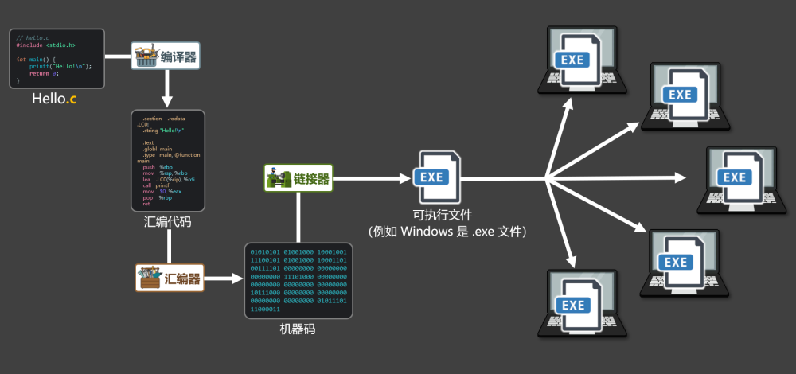
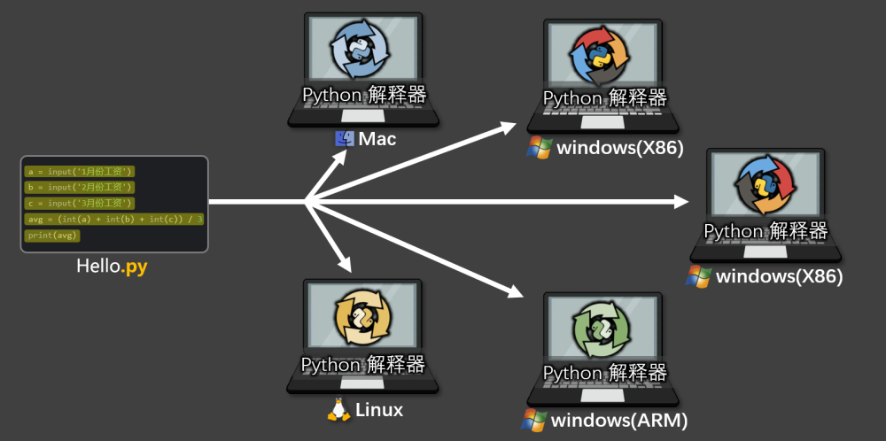

# 4. 『编译型语言』与『解释型语言』

对于高级语言来说，我们会根据其转换成二进制指令过程的不同，可将其分为：『编译型』和『解释型』

## 4.1. 编译型语言

将程序翻译成计算机能理解的二进制内容，并且通常会生成一个可执行文件，例如在 windows 系统上生成的可执行文件是.exe文件，常见的『编译型』语言有：C、C++、Go、Rust 等。

编译型语言

编译型语言的特点：

优势：同一运行平台，代码只需编译一次，且执行效率高。

劣势：跨平台性差，大型项目编译时间较长，开发效率略低。

## 4.2. 解释型语言

将程序一句一句的翻译为：计算机可以执行的指令，整个过程通常不生成可执行文件，常见的解释型语言有：Python、Php、JavaScript 等。

解释型语言

解释型语言的特点：

优势：跨平台性好，无需编译，开发调试灵活高效。

劣势：每次运行都需要解释，执行效率较低。

## 4.3. 二者对比

|  | 编译型语言 | 解释型语言 |
| --- | --- | --- |
| 举例 | C、C++、Go、Rust 等 | Python、JavaScript、Ruby 等 |
| 执行流程 | 运行前把所有程序一次性翻译成机器码，并生成可执行文件。 | 运行时靠对应的解释器，把代码一句一句翻译成机器码执行。 |
| 是否生成可执行文件 | 是，一次编译多处运行。 | 否，每次都要靠解释器翻译后再运行。 |
| 运行速度 | 快 | 慢 |
| 是否跨平台 | 否，需要针对平台编译。 | 是，只要该平台下有解释器，就能运行。 |
| 适合场景 | 系统底层、性能要求较高的场景。 | 脚本、数据分析、AI 应用、Web开发等。 |
