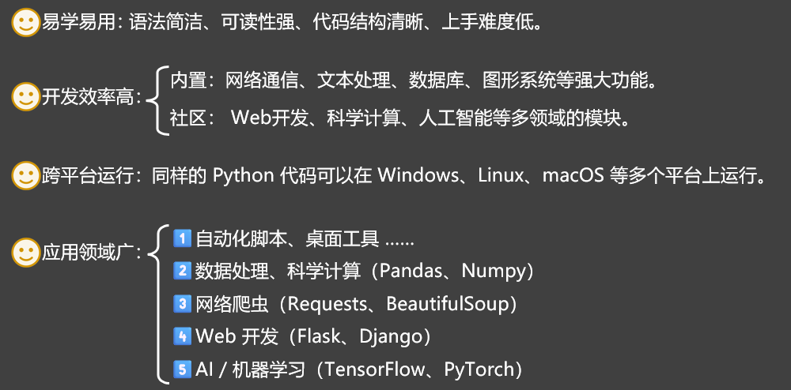
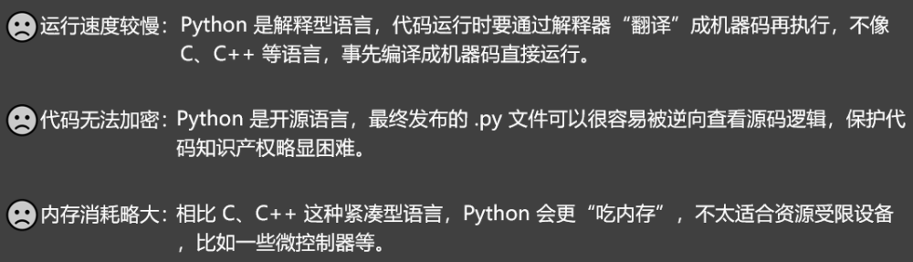

# 1. Python 概述

## 1.1. Python 的起源

Python 的作者 Guido van Rossum 来自荷兰（国内爱称：龟叔），拥有数学与计算机背景，他发现用： C、Fortran 等语言写程序太费劲，而 Shell 虽然轻松，但功能却很有限。

1989 年圣诞节，龟叔开始动手编写一种既能像 C 那样全面操控系统，又能像 Shell 一样好上手的解释器，并以他喜爱的喜剧《Monty Python’s Flying Circus》为灵感，命名为“Python”。

Python 的设计哲学是“优雅、明确、简单”，Python 提倡：最好只有一种方法来做一件事，它的第一个公开版本于 1991 年问世，如今已成为全球最受欢迎的编程语言之一。

## 1.2. Python 的特点

Python 的优点：

Python 的缺点：

## 1.3. 为何 AI 领域广泛使用 Python ？

主要原因是 Python 具备如下的特点：

简洁直观的开发体验。

丰富强大的框架生态。

与底层语言高效协作。

社区活跃且人才充足。

业内大厂 + 主流推动。

## 1.4. Python 的版本

1991年：Python 0.9.0发布。

1994年：Python 1.0正式发布（进入正式版阶段）。

2000年：Python 2.0发布。

2008年：Python 3.0发布，与Python 2不兼容。

2010年：Python 2.7发布，作为Python 2.x的最后主版本，被广泛使用多年。

......

2020年：Python 2官方停止维护，同时Python 3.9发布。

2021年：Python 3.10发布。

2022年：Python 3.11发布，平均性能提升10%-60%。

2023年：Python 3.12发布，进一步优化性能和类型提示。

2024年：Python 3.13发布。

2025年：持续迭代。
