# 3. 运行 Python 程序的几种方式总结

运行 Python 程序，有常见的以下三种方式：

第一种方式：命令行（终端）模式

第二种方式：脚本模式

第三种方式：集成开发环境（IDE）模式

备注：第三种方式，其实是第二种方式的图形化操作，本质上算是一种模式。

## 3.1. 命令行模式

同时按下 Win 键和 R ，随后输入cmd ，打开终端（命令行）。

在终端（命令行）中输入python，进入 Python 交互模式。

输入print(100)，按下回车，控制台会打印：100。

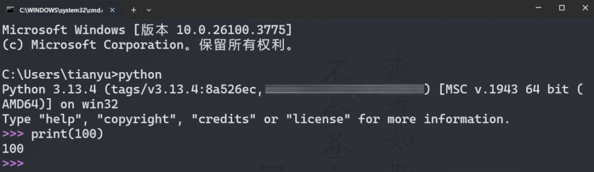

## 3.2. 脚本模式

在桌面上新建一个code文件夹，随后新建一个文本档，将其重命名为test.py

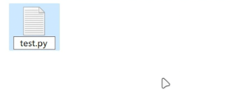

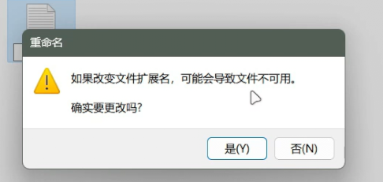

使用记事本打开test.py，在其中写好代码并保存。

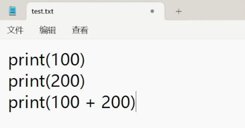

找到test.py所在的文件夹

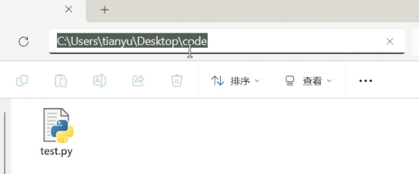

在资源管理器上方输入cmd并回车，就会打开命令提示符并进入当前路径。

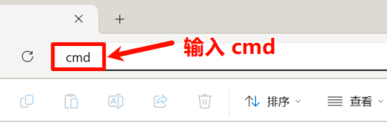

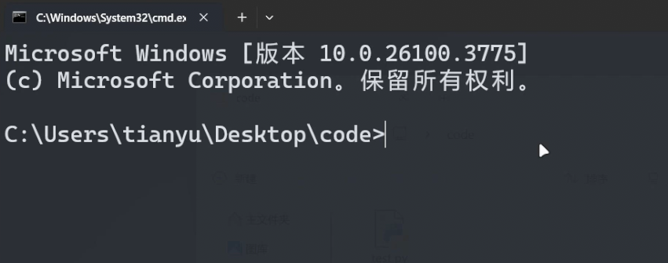

在命令提示符中输入python test.py执行程序，就会看到打印的内容。

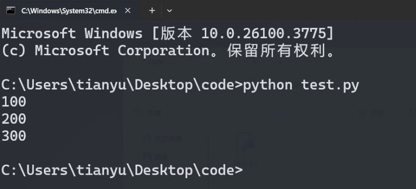

## 3.3. IDE模式

鼠标右键工程文件夹，选择新建 python 文件。

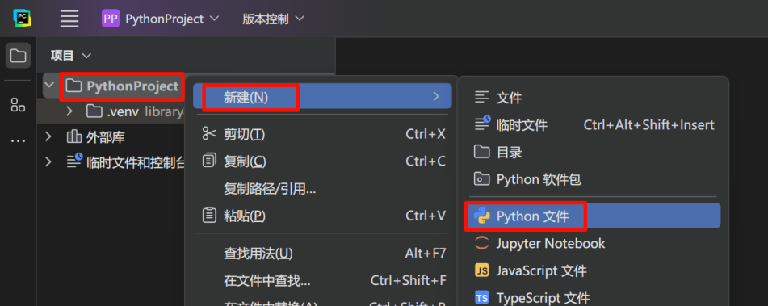

输入文件名，确认后按下回车

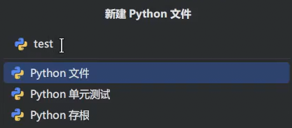

输入print(100)，随后在文件空白处点击鼠标右键，选择：运行test。

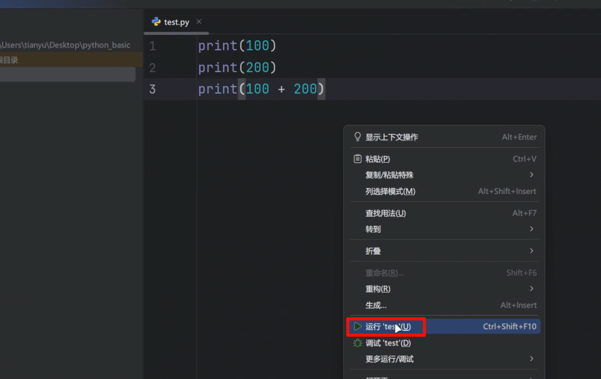
