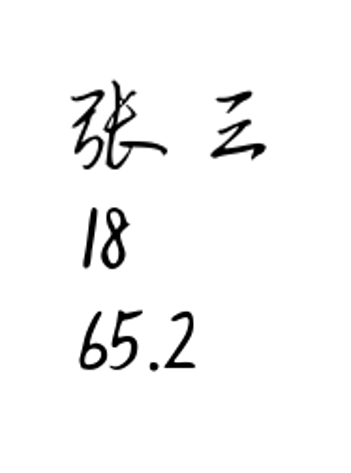
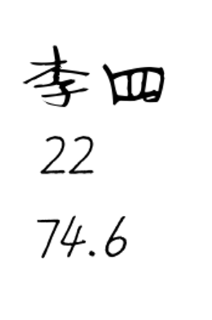
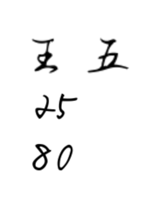

# 1. 字面量

## 1.1. 概述

来看这样一个场景：老师让学生把：姓名、年龄、体重写在纸上，纸上的文字，就是学生想要表达的内容，这些内容不需要计算、也不需要转换，就是字面上的含义，一看就能理解。







在程序中，也有上述这些“写出来就能被理解”的内容，这些内容在程序中叫做字面量，即：字面量就是直接写在代码中的“具体值”。

## 1.2. 写法

下面代码中的内容，都是字面量。

```
'张三'
18
65.2

'李四'
22
74.6

'王五'
25
80
```

以上代码中的 '张三'、'李四'、'王五' 均为字符串。所谓字符串，就是由“字符”组成的“串”。例如，字符串 '张三' 由 '张' 和 '三' 两个字符构成。

从本质上看，字符串属于文本类型，可以由任意数量的字符组成——无论是中文、英文、数字，还是各种符号。此处我们只需对字符串的概念有初步认识，后续课程中将对其进行详细讲解。

📢注意：字符串必须要放到引号中，使用：单引号、双引号、三个单引号、三个双引号都可以，但必须是英文的引号。

📋备注：写在 Python 文件头部的字符串，会被自动识别成 docstring（文档字符串），文档字符串的主要作用是：对当前 Python 文件进行说明，且文档字符串必须用三个双引号。

```
"""这是我写的第一个Python文件"""

'张三'
18
65.2
```
