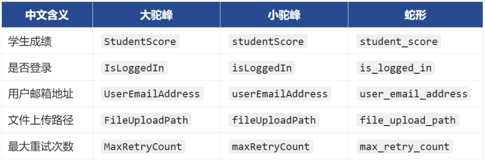

# 2. 变量与常量

## 2.1. 变量

1️⃣前情回顾

在上一节中，我们通过字面量的形式，记录了张三的体重，例如：

```
65.2
```

现在需要打印一些体重相关的内容，代码如下：

```
print('张三的体重是', 65.2)
print('对于', 65.2, '这个体重，张三觉得不满意')
print('张三决定开始减肥，希望体重比', 65.2, '还要小')
```

📌小贴士：

使用print(内容)可以输出内容（也叫：打印内容）这里说的“打印”不是打印在纸上，而是指：把内容呈现在控制台上。

使用print(内容1, 内容2, 内容3)可以输出多个内容，不同内容之间用逗号做分隔，输出的多个内容默认会在同一行，且输出的多个内容之间会有一个空格。

📋备注：print()还有很多使用细节和技巧，后面会逐步介绍。

我们会发现，代码中的65.2被使用了 3 次，当要修改张三的体重为64.2时，就需要手动修改 3 个地方，修改起来会很麻烦，就像下面这样：

```
print('张三的体重是', 64.2)
print('对于', 64.2, '这个体重，张三觉得不满意')
print('张三决定开始减肥，希望体重比', 64.2, '还要小')
```

2️⃣什么是变量？

变量是数据的“代号”它可以和数据建立绑定关系，通过变量可以使用数据，或更新数据，之所以叫变量，是因为：它和某个值的绑定关系，可以随时改变。

例如：在上述代码中，我们可以把体重值和某个『变量』建立一个『绑定关系』，以后用到体重的时候，直接“呼唤”这个变量就可以了。

3️⃣具体语法

语法为：变量名 = 值，例如下面代码中的：name、age、weight都是变量。

```
name = '张三'
age = 18
weight = 65.2
```

📢注意：变量名不需要加引号！

4️⃣示例代码

使用weight变量存储体重值，并在后续代码中，多次使用weigth变量。

```
weight = 65.2

print('张三的体重是', weight)
print('对于', weight, '这个体重，张三觉得不满意')
print('张三决定开始减肥，希望体重比', weight, '还要小')
```

需要修改体重时，通过weight就可以修改，修改后再去使用weight时，就是修改后的值了。

```
weight = 65.2
weight = 64.2

print('张三的体重是', weight)
print('对于', weight, '这个体重，张三觉得不满意')
print('张三决定开始减肥，希望体重比', weight, '还要小')
```

5️⃣几个关键点

在数学中，像 1 + 1 = 2这样的等式表示：等号左边的1 + 1是具体的运算过程，等号右边的2是该运算的结果。

在代码age = 18中，等号表示：将等号右侧的值与左侧的变量建立绑定关系。因此，当程序中需要表示年龄 18时，可以使用变量age；同样，也可以通过age来修改该数值。

age = 18这一行代码也被称为“赋值语句”，意思是将右侧的18赋给变量age。

在 Python 中，变量的创建与赋值是同时完成的。也就是说，当程序中出现一个变量时，它必须立即与某个值建立绑定关系。

变量名不应过于随意，命名时需要遵守一定的规则（具体命名规则将在下一小节讲解）。

## 2.2. 标识符命名规则

1️⃣什么是标识符？

在程序中我们给： 变量、函数、类.....所起的名字，统称为标识符，即：在程序中所有我们可以自己起的名字，都是标识符。

2️⃣标识符命名规则如下：

只能包含：数字、字母、下划线，且不能以数字开头，不能包含空格。

区分大小写，即Name和name是两个不同的标识符。

不能使用关键字（关键字的解释在下面⬇️）。

标识符尽量不要与内置函数同名。

标识符虽然没有长度限制，但应追求：简洁清晰，具有描述性。

3️⃣Python 中的关键字

所谓“关键字”，是指那些：已被 Python 语言预先保留、具有特定含义和功能的标识符。这些关键字被系统征用，因而不能再作为变量名、函数名或其他标识符使用。

```
False     	None      	True      	and       	as
assert    	async     	await     	break     	class
continue  	def       	del       	elif      	else
except    	finally   	for       	from      	global
if        	import    	in        	is        	lambda
nonlocal  	not       	or        	pass      	raise
return    	try       	while     	with      	yield
```

📋备注：上述关键字暂不作详细说明。随着课程的推进，我们会在实际讲解中逐步接触并使用这些关键字，届时再进行深入解释。初学者无需在此阶段强行记忆（这也并不现实），随着使用频率的增加，便会在后续学习中自然掌握。

4️⃣常见的三种命名风格

大驼峰（UpperCamelCase）: 每个单词的首字母大写，例如：UserName

小驼峰（lowerCamelCase）: 首词的首字母小写，后面单词首字母大写，例如：userName

蛇形（snake_case）：单词间用下划线连接，例如：user_name

💡Python 中推荐使用『蛇形（snake_case）』写法。

举几个例子：



## 2.3. 常量

1️⃣什么是常量？

在程序中一旦被赋值，就不希望被修改的量（区别于变量）。

2️⃣具体语法

Python 中一般约定使用全大写变量名来表示常量，涉及到多个单词时，用下划线做分隔。

```
ADULT_AGE = 18
MONTHS_IN_YEAR = 12
MAX_USERS = 1200
PASSING_SCORE = 60
MAX_USERS = 1300
```

3️⃣Python 中没有强制的常量机制

当强制对常量进行修改时，最终也能改掉，但要自觉不改，这是 Python 程序员之间的约定。

```
MONTHS_IN_YEAR = 12
print(MONTHS_IN_YEAR)

MONTHS_IN_YEAR = 13
print(MONTHS_IN_YEAR)
```
