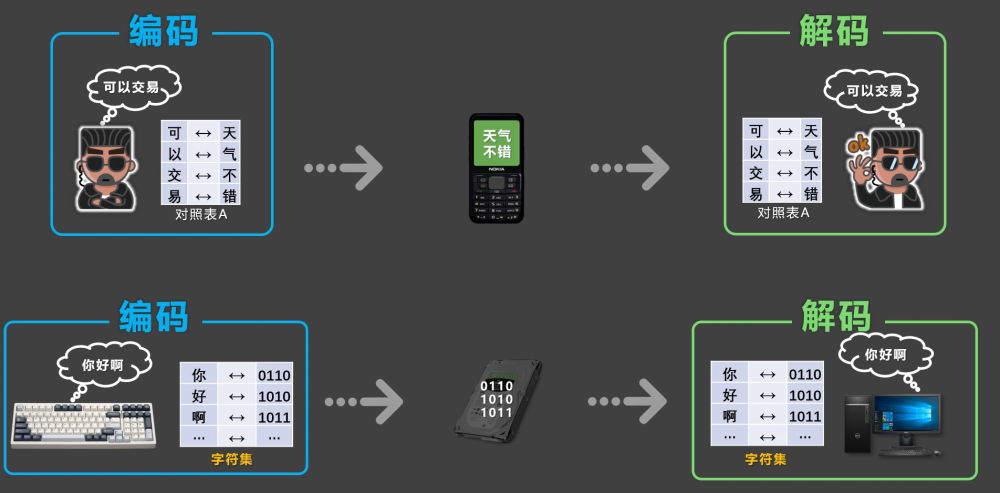

# 4. 字符编码

## 4.1. 概述

计算机对数据会进行两个常见的操作，分别是：存储数据、读取数据。

存储数据时，计算机会进行编码。

读取数据时，计算机会进行解码。



编码与解码，会遵循一定的规范，这个规范就是字符编码，并且编码与解码，必须遵循相同的编码规范，若所用的规范不一致，就会出现乱码。

```
# coding=iso-8859-1
print('你好啊！')  # ä½ å¥½å•Šï¼
```

## 4.2. 常见编码方式

1. ASCII：大写字母、小写字母、数字、一些符号，共计 28个字符。

2. ISO 8859-1：在ASCII基础上扩展，支持西欧语言，共计 256 个字符。

3. GB2312：中国国家编码标准，收录约 6763 个简体中文常用汉字和符号。

4. GBK：兼容GB2312，进一步扩展，支持简繁体中文和其他汉字，共收录 2 万多个字符。

5. UTF-8：国际通用的编码格式，也叫“万国码”，支持世界所有语言的字符，包括：中文、英文、阿拉伯文、日文、韩文等，向下兼容ASCII，是现代互联网最常用的编码格式。

✅最佳实践：实际开发中，几乎都采用UTF-8编码保存文件。

📋备注：在 Python3 中，可以不写文件编码声明，因为 Python3 默认就使用UTF-8编码。
