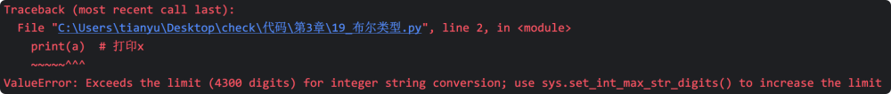
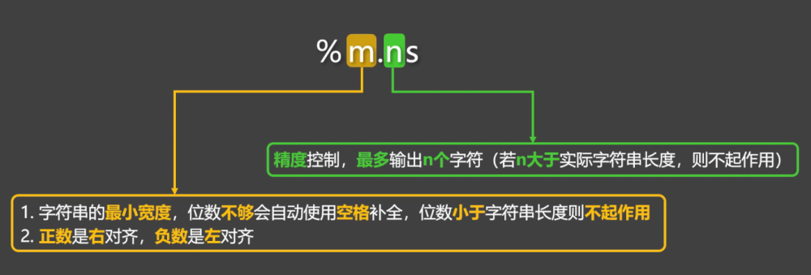
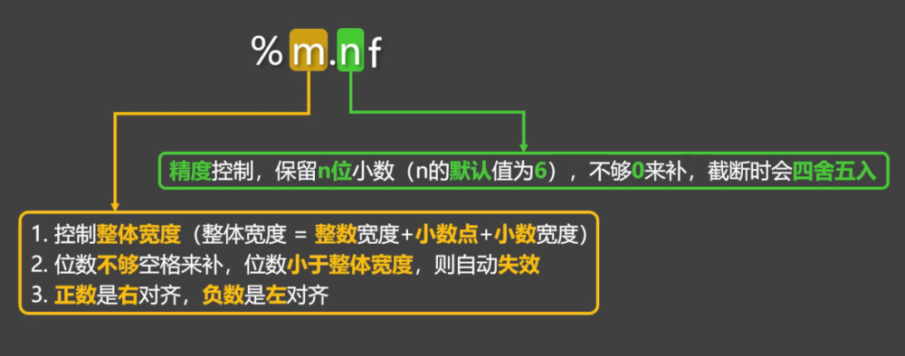
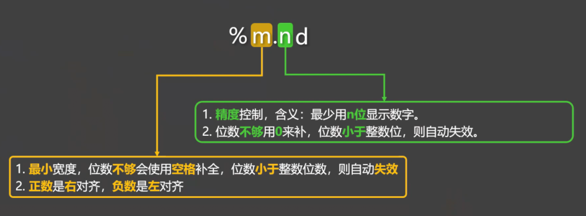

# 5. 数据类型

## 5.1. 概述

就像生活中的物品，都有自己所属的分类一样，数据也有自己所属的『数据类型』。

例如之前写过的这段代码：

```
'张三'
18
65.2

"李四"
22
74.6
```

在上述代码中：

✅'张三'、"李四"这两个字面量，属于『字符串』类型。

✅18、22 这两个字面量，属于『整数』类型。

✅65.2、74.6这两个字面量，属『浮点数』类型。

三种最常见的数据类型：

| 类型名称 | 英文名 | 举例 | 说明 |
| --- | --- | --- | --- |
| 整型 | int | 5, -3, 0, 2025 | 整数（不带小数点的数） |
| 浮点型 | float | 3.14, -0.01 | 带小数点的数 |
| 字符串 | string | "Hello", 'Python' | 文本，要用引号包起来 |

📋备注：数据类型不只上述的这三种，还有很多种，我们暂且先知道以上这三种即可，其他数据类型会在后续章节中逐步讲解。

## 5.2. 查看数据类型

通过type()可以查看数据类型，type()会返回当前数据的具体类型。

```
# 使用变量接收 type() 返回的类型
result1 = type('张三')
result2 = type(18)
result3 = type(72.5)

print(result1) # <class 'str'> 注意此处返回的不是string，是 string 的简写：str
print(result2) # <class 'int'>
print(result3) # <class 'float'>
```

📢注意：在 Python 中：变量无类型，数据有类型。

例如a = 10，其中a是没有类型的，但a所关联的数据10是有类型的，10是整型，我们经常说a是整型，其实是一种不太严谨的表述，严谨的表述应该是：a所对应的数据10是整型。

也可以把变量交给type()，最终返回的是：变量所对应的数据的类型。

```
name = '张三'
age = 18
weight = 72.5

# 使用变量接收type()返回的类型
result1 = type(name)
result2 = type(age)
result3 = type(weight)

# 打印这三个数据类型
print(result1)  # <class 'str'>
print(result2)  # <class 'str'>
print(result3)  # <class 'float'>
```

当然也可以不使用变量接收，直接打印type()的结果

```
name = '张三'
age = 18
weight = 72.5

# 打印这三个数据类型
print(type(name))  # <class 'str'>
print(type(age))  # <class 'str'>
print(type(weight))  # <class 'float'>
```

## 5.3. 整型

1️⃣什么是整型？

所谓整型就是没有小数点的数字， Python 中的整型，可以是任意大小的整数，包括负整数。

2️⃣分隔符

当书写很大的数时，可使用下划线将数字分组，使其更清晰易读；Python 自动忽略数字之间的下划线，并且这种写法也适用于浮点数，但要注意：此种写法只有 Python3.6 及以上版本才支持。

```
num1 = 10_000_000
print(num1)
```

3️⃣整型上限值

Python 中存储整数上限值的大小取决于：计算机的内存和处理能力，我们先来认识一下『幂运算符』，代码如下：

```
a = 3 ** 2  # 表示3的平方
b = 2 ** 3  # 表示2的3次方

print(a)  # 9
print(b)  # 8
```

通过幂运算，构建一个很大的数，随后打印它，我们会发现：代码报错了。

```
a = 9 ** 9999  # 9的9999次方
print(a)  # 打印x
```



上面报错中提及了"Exceeds the limit (4300 digits)"，但这并不代表 Python 最大只能表示4300位的数，比如我们把print删掉，会发现代码正常运行，并且此时的a也是可以正常参与数学运算的。

```
a = 9 ** 9999  # 9的9999次方
b = a + 100
```

那加上了print(a)为什么报错呢？原因如下：

调用print(a)时，Python 底层会把a的类型转换成『字符串类型』再输出，而从 Python3.11 起，Python 对超大整数转换字符串的长度进行了限制，默认位数是4300位。

💡扩展知识（了解即可）：

通过如下代码，可以解除字符串转换时的4300位限制，如下代码中包含模块相关内容，我们还没有讲到，所以不必纠结下面代码的具体含义，只需要先知道：4300位的限制可以修改即可。

```
import sys
sys.set_int_max_str_digits(0) # 设置为0表示不作任何限制

x = 9 ** 9999  # 9的9999次方
print(x)  # 打印x
```

## 5.4. 浮点型

1️⃣什么是浮点型？

所谓浮点型，就是带小数点的数字，比如：3.14、-0.5、2.0都是浮点数。

2️⃣浮点型的表示方式

直接写

```
# 浮点型就是带有小数点的数字。
weight = 65.2
balance = 1425.58
out_temp = -25.2
price = 120.0
```

科学计数法

```
# 浮点型的科学计数法表示。
speed_of_sound = 3.4e+2  # 3.4乘以10的2次方。
world_population = 7.8e9  # 7.8乘以10的9次方。
distance_sun_earth = 1.496E8  # 1.496乘以10的8次方。
speed_of_light = 2.998E+8  # 2.998乘以10的8次方。

one_ml = 1e-3  # 1乘以10的-3次方。
one_mg = 1E-3  # 1乘以10的-3次方。
```

## 5.5. 字符串

### 1️⃣字符的四种定义方式

| 写法 | 示例 | 适用场景 |
| --- | --- | --- |
| 单引号 | '你好，尚硅谷' | 单行字符串（不能直接换行，换行需要使用圆括号） |
| 双引号 | "你好，尚硅谷" | 单行字符串（不能直接换行，换行需要使用圆括号） |
| 三个单引号 | '''你好，尚硅谷''' | 多行字符串（可以直接换行） |
| 三个双引号 | """你好，尚硅谷"""" | 多行字符串（可以直接换行） |

下面代码所表示的都是字符串：

```
# 单引号和双引号的写法是等价的，二者都不能直接换行（要用圆括号才能换行），单引号用的多。
message1 = '尚硅谷，让天下没有难学的技术!'
message2 = "尚硅谷，让天下没有难学的技术!"

# 三个单引号的写法，可以直接换行，并且可以作为多行注释使用。
message3 = '''尚硅谷，让天下没有难学的技术!'''

# 三个双引号的写法，可以直接换行，也可以作为多行注释使用，还能作为文档字符串使用。
message4 = """尚硅谷，让天下没有难学的技术!"""
```

### 2️⃣字符串的格式化输出

写法 1：直接用加号进行拼接，写起来很麻烦，而且只能是字符串之间拼接。

```
name = '张三'
gender = '男'
weight = 65.2
age = 12

info1 = '我叫' + name + '，我是' + gender + '生'
```

写法 2：使用占位符。

具体规则：

%s占位字符串

%f占位浮点数

%i占位整数

%d占位十进制的整数

%s是万能的（如果我们提供的数据不是字符串，那 Python 就会把数据转成字符串）。

```
name = '张三'
gender = '男'
weight = 65.2
age = 12

info2 = '我叫%s，我是%s生，我体重是%f，年龄是%d' % (name, gender, weight, age)
```

写法 3：使用 f-string，这是目前 Python 最推荐的方式。

```
name = '张三'
gender = '男'
weight = 65.2
age = 12

info3 = f'我叫{name}，我是{gender}生，我体重是{weight}，年龄是{age}'
```

### 3️⃣占位符精度控

在占位符前方，可以使用m.n的形式来指定精度，具体规则见下图：







示例代码：

```
info = '我叫%-4.1s，性别是%3.2s，体重是%-9.3f，年龄是%-6.4d' % (name, gender, weight, age)
```

### 4️⃣转义字符

在字符串中，有些字符不能直接写（换行、制表符、引号等）这时就要使用转义字符。

例如下面的message字符串中包含了一个单引号，但如果就这样直接写，就会报错

```
print('在Python中，可以使用'包裹一个字符串')
```

使用转义字符后，即可正常输出：

```
print('在Python中，可以使用\'包裹一个字符串')
```

常见的转义字符梳理：

| 转义字符 | 表示的含义 |
| --- | --- |
| \' | ' |
| \" | " |
| \n | 换行 |
| \\ | \ |
| \b | 删除前一个字符 |
| \r | 使光标回到本行开头，覆盖输出 |
| \t | 表示水平制表符（让光标跳转到下一个制表位） |

测试代码：

```
# 使用 \' 输出 '
print('在Python中，可以使用\'包裹一个字符串')

# 使用 \" 输出 "
print("在Python中，可以使用\"包裹一个字符串")

# 使用 \n 进行换行
print('注册会员需要以下信息：\n姓名\n年龄\n手机号')

# 使用 \\ 输出 \
print('D:\\nice')

# 使用 \b 删除前一个字符
print('helloo\b')

# 使用 \r 使光标回到本行开头，覆盖输出
print('67%\r68%')

# 使用 \t 表示水平制表符（让光标跳转到下一个制表位）
# 一个制表位到底是几位，是不确定的，但我们可以通过在字符串后面加.expandtabs()来指定位数。
print('1234123412341234')
print('ab\tcd.expandtabs(4)')
print('abc\td.expandtabs(4)')
print('abcd\ta.expandtabs(4)')
print('我是\t中文.expandtabs(4)')

print('12341234123412341234')
print('姓名\t性别\t年龄')
print('张三\t男\t\t18')
print('李四\t女\t\t25')
print('王五\t男\t\t32')
```
