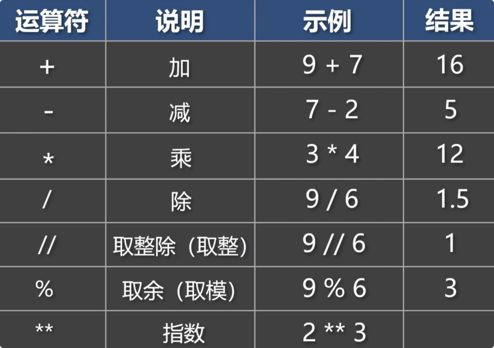
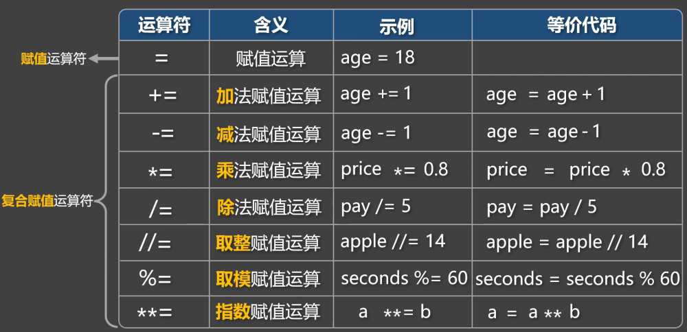
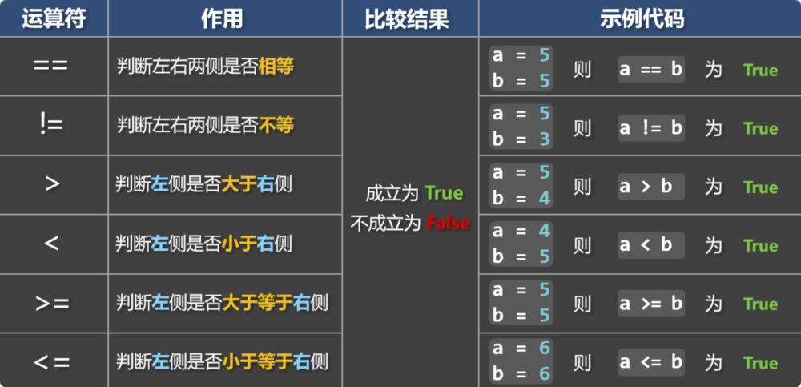
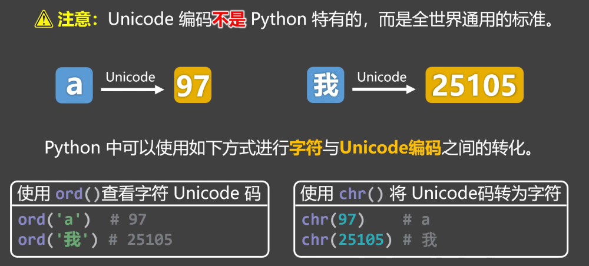
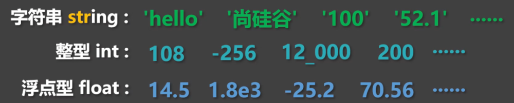

# 7. 运算符

## 7.1. 算数运算符

常用的算数运算符如下：



测试代码

```
# 加
print(9 + 7)
# 减
print(7 - 2)
# 乘
print(3 * 4)
# 除
print(9 / 3)
# 取整
print(9 // 6)
# 取余
print(9 % 6)
# 指数
print(2 ** 3)
```

## 7.2. 赋值运算符

常用的赋值运算符如下：



测试代码：

```
age = 18
print(age)

price = 52
print(price)
age = 18

# 加法复合运算符
age += 1  # 等价于：age = age + 1
print(age)

# 减法复合运算符
age = 18
age -= 1  # 等价于：age = age - 1
print(age)

# 乘法复合运算符
price = 100
discount = 0.8
price *= discount  # 等价于：price = price * discount
print(price)

# 除法复合运算符
pay = 100
num = 5
pay /= 5  # 等价于：pay = pay / num
print(pay)

# 取整赋值运算符
apple = 31
num = 14
apple //= num  # 等价于：apple = apple // num
print(apple)

# 取模赋值运算符
seconds = 386
minutes = 60
seconds %= minutes  # 等价于：seconds = seconds % minutes
print(seconds)

# 指数赋值运算符
a = 2
b = 3
a **= b  # 等价于：a = a ** b
print(a)
```

## 7.3. 比较运算符

常用的比较运算符如下：



📋备注：True 和 False 是布尔类型，会在下一小节讲，暂且先知道：True 表示真，False 表示假。

```
# 使用==判断左右两侧是否相等
a = 5
b = 7
c = '5'
result = a == c
print(result)

# 使用!=判断左右两侧是否不等
a = 5
b = 7
c = '5'
result = a != c
print(result)

# 使用>判断左侧是否大于右侧
a = 9
b = 7
c = '5'
result = a > b
print(result)

# 使用<判断左侧是否小于右侧
a = 3
b = 7
c = '5'
result = a < b
print(result)

# 使用>=判断左侧是否大于等于右侧
a = 6
b = 7
c = '5'
result = a >= b
print(result)

# 使用<=判断左侧是否小于等于右侧
a = 9
b = 7
c = '5'
result = a <= b
print(result)

# 以上这些比较运算符，同样适用于字符串
msg1 = 'abc'
msg2 = 'abc666'
print(msg1 == msg2)

msg1 = 'abc'
msg2 = 'abc'
print(msg1 != msg2)
```

📌小贴士：

字符串进行比较时，是依次比较每个字符的 Unicode 编码。

Unicode 编码是一种全球通用的字符编码标准，它会给每个字符都分配一个“身份证号”。

具体比较规则是：

从左到右，依次比较两个字符串中的字符。

先比较第一个字符：

如果两个字符不相等，就直接根据它们的 Unicode 码值比较大小。

如果相等，则继续下一步。

继续比较下一个字符，依次往后进行，直到遇到不相等的字符为止。

当出现不相等的字符时，比较它们的 Unicode 码大小，后续的字符将不再参与比较。



```
# 使用ord()查看指定字符的Unicode编码
print(ord('a'))
print(ord('我'))

# 使用chr()将Unicode编码转为字符
print(chr(97))
print(chr(25105))

msg1 = 'abc'
msg2 = 'xyz'
msg3 = '我爱你'
msg4 = '中国'
msg5 = 'abc'
msg6 = 'abcdef'
print(msg3 <= msg1)
```

## 7.4. 布尔类型

我们之前讲的这些类型：字符串、整型、浮点型，这些类型中，每一种类型都有无限多的具体值。



但布尔类型的具体值，只有两个，分别是：True和False，其中：True表示真，False表示假。


布尔值常用于表示：条件是否成立、事件是否发生、操作是否成功、等逻辑状态。

📢注意：True 和 False 的首字母必须大写。

```
# 自己定义的布尔值
a = True
b = False

# 靠程序执行得到的布尔值
c = 5 > 3
d = 7 < 2

print(type(a), a)  # True
print(type(b), b)  # Flase
print(type(c), c)  # True
print(type(d), d)  # Flase
```

布尔类型是int类型的子类型，底层的本质是用1表示True，用0表示False。

```
# 布尔类型是int类型的子类型，底层的本质是用1表示True，用0表示False
print(int(True))   # 1
print(int(False))  # 0

print(4 + True)   # 5
print(8 - False)  # 8

print(True + True)   # 2
print(True - False)  # 1

print(7 > True)    # True
print(False <= 0)  # True
```

Python中除0以外的任何数，转为布尔值后都为 True

```
# 使用bool()将指定内容转为布尔类型
print(bool(1))  # True
print(bool(0))  # False

print(bool(300))  	# True
print(bool(25.6))  	# True
print(bool(1.8e3))  # True
print(bool(12_000)) # True
print(bool(-10))  	# True
```

Python中除空字符串以外的任何字符串，转为布尔值都是 True

```
print(bool('hello')) # True
print(bool('0'))	 # True
print(bool('18.5'))	 # True
print(bool('-9'))	 # True
print(bool(''))	     # False
```

## 7.5. 逻辑运算符

常用的逻辑运算符如下：


1️⃣and 运算符：用于判断其两侧的值，是否都为True

```
print(True and True)   # True
print(True and False)  # False
print(False and True)  # False
print(False and False) # False

print(8 > 7 and 8 > 7) # True
print(8 > 7 and 2 > 3) # False
print(2 > 3 and 8 > 7) # False
print(2 > 3 and 2 > 3) # False
```

and具备“逻辑短路”能力，以下代码中包含3/0这种错误代码，但最终没有报错。

```
print(False and 3 / 0)  # False
print(3 > 9 and 3 / 0)  # False
```

and返回的不一定是布尔值，它返回的是某个参与计算的值本身，and会先看左边，如果左边是“假”，就直接返回左边，否则返回右边；若参与and运算的值不是布尔值，那 Python 会自动转为布尔值，然后再进行逻辑操作。

```
print(2 - 2 and True) # 0
print('' and True)
print(True and 8 / 2)  # 4.0
print(3 + 3 and 3 * 4) # 12
```

2️⃣or 运算符：用于判断其两侧，是否至少有一个为True（只要有一个是True，那就返回True）

```
print(True or True)    # True
print(True or False)   # True
print(False or True)   # True
print(False or False)  # False

print(9 > 2 or 9 > 2)  # True
print(9 > 2 or 3 < 1)  # True
print(3 < 1 or 9 > 2)  # True
print(3 < 1 or 3 < 1)  # False
```

or同样具备“逻辑短路”的能力，以下代码中包含3/0这种错误代码，但最终没有报错。

```
print(True or 3 / 0) # True
print(9 > 3 or 3 / 0) # True
```

or返回的也不一定是布尔值，它返回的是参与计算的值本身，or会先看左边，如果左边为“真”，就直接返回左边，否则返回右边；若参与or运算的值不是布尔值，那 Python 会自动转为布尔值，然后再进行逻辑操作。

```
print(7 - 2 or False)    # 5
print('你好' or '尚硅谷') # 你好
print(False or 8 / 2)	 # 4.0
print(2 - 2 or 3 * 4)    # 12
```

3️⃣not 运算符：not用于取反，不过要注意：如果参与not运算的值不是布尔值，那 Python 会自动将其转为布尔值，然后再进行逻辑操作。

```
print(not True)  # False
print(not False) # True
print(not 3 > 2) # False
print(not 3 < 2) # True
```

not返回的值，一定是布尔值！

```
print(not 0) 	  # True
print(not 3 > 2)  # False
print(not 9 // 4) # False
print(not 'abc')  # False
```
