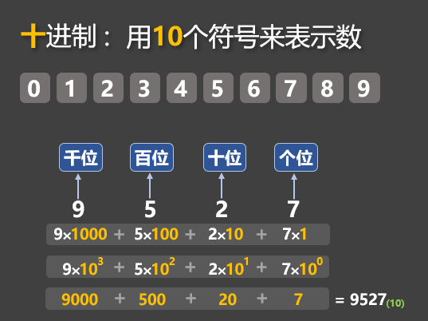
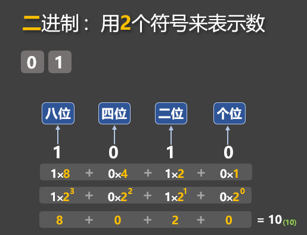
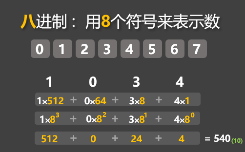
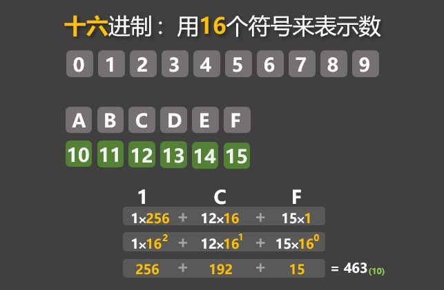
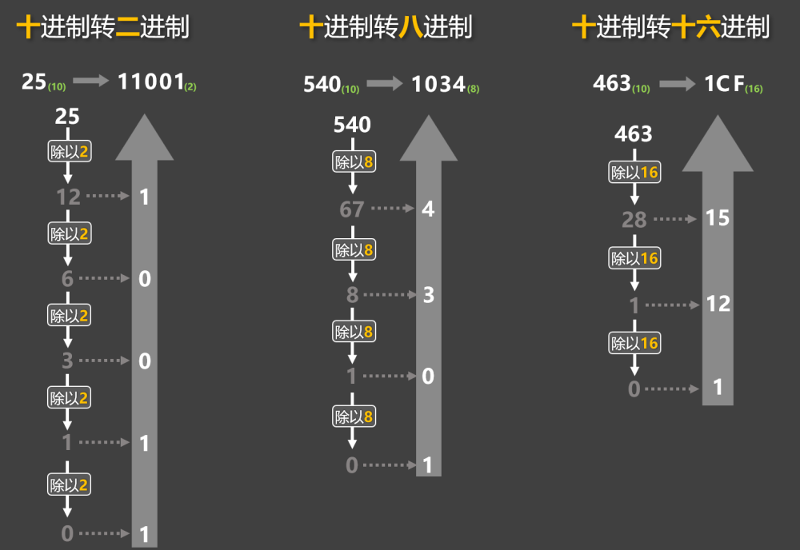
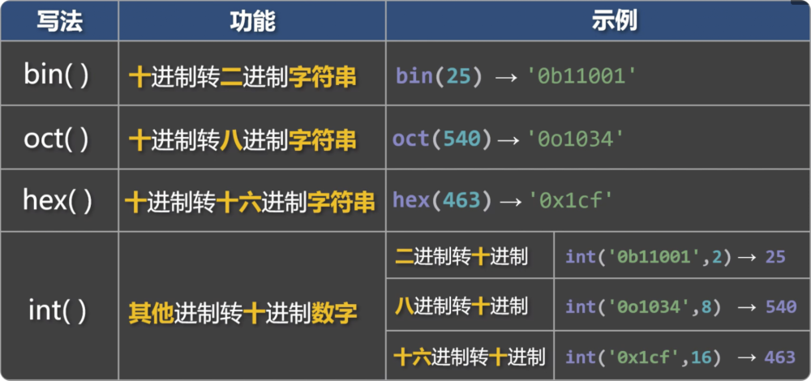

# 8. 进制

## 8.1. 概述

进制是指：用多少个符号，来表示数值的一种『记数方式』。比如我们平时使用的『十进制』，就是用0 ~ 9这十个符号来表示所有的数，而计算机中存储和运算的数据，都是二进制，常见的进制与规则如下：

二进制：0 ~ 1，满2进1。

八进制：0 ~ 7，满8进1。

十进制：0 ~ 9，满10进1。

十六进制：0 ~ 9，A-F，满16进1。

📋备注： 在十六进制中，除了0 ~ 9这十个数字外，还引入了字母，以便表示超过9的值，字母A对应十进制的10，字母B对应十进制的11，同理字母 C、D、E、F 分别对应十进制的：12、13、14、15。

各进制的表示如下图：



十进制数：9527



二进制数：1010



八进制数：1034



十六进制数：1CF

## 8.2. 代码中如何表示不同进制

在 Python 中，不同进制的数，有不同的前缀：

二进制：以0b或0B开头表示。

八进制：以0o开头表示

十进制：无需前缀，正常编写即可。

十六进制：以0x或0X开头表示，此处的A-F不区分大小写。

```
# 0b开头表示二进制
num1 = 0b11001
# 0o开头表示八进制
num2 = 0o1034
# 0x开头表示十六进制
num3 = 0x1cf
```

📋备注：Python 中所有的『非十进制』数字，只是代码层面的编写方式，只是给程序员看的，Python 在进行：计算、打印等操作时，会自动将这些『非十进制』数字，转为『十进制』数字。

```
# 0b开头表示二进制
num1 = 0b11001
# 0o开头表示八进制
num2 = 0o1034
# 0x开头表示十六进制
num3 = 0x1cf

# Python 在对上面的 num1、num2、num3进行计算、打印等操作时，会自动将其转为十进制
print(num1, num2, num3)  # 25  540  463
print(num1 + 1)  # 26
print(str(num2)) # 540
print(num3 > 400) # True
```

## 8.3. 不同进制之间的转换

1️⃣手动转换：使用连除法

十进制转二进制：不断用 2 去除这个数，直到商为 0，然后把每次的余数倒着写即可。

十进制转八进制：不断用 8 去除这个数，直到商为 0，然后把每次的余数倒着写即可。

十进制转十六进制：不断用 16 去除这个数，直到商为 0，把每次的余数倒着写，若余数 ≥ 10，则依次用 A、B、C、D、E、F 表示 10~15。



2️⃣借助 Python 提供的内置函数，实现进制转换


