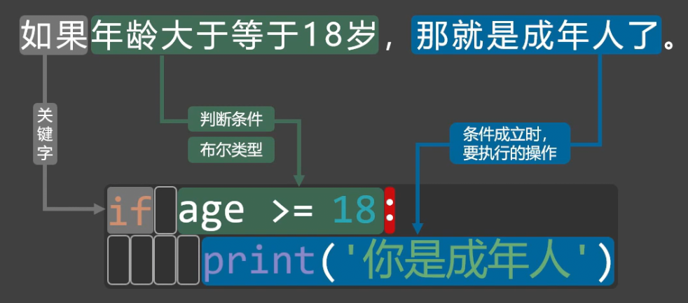
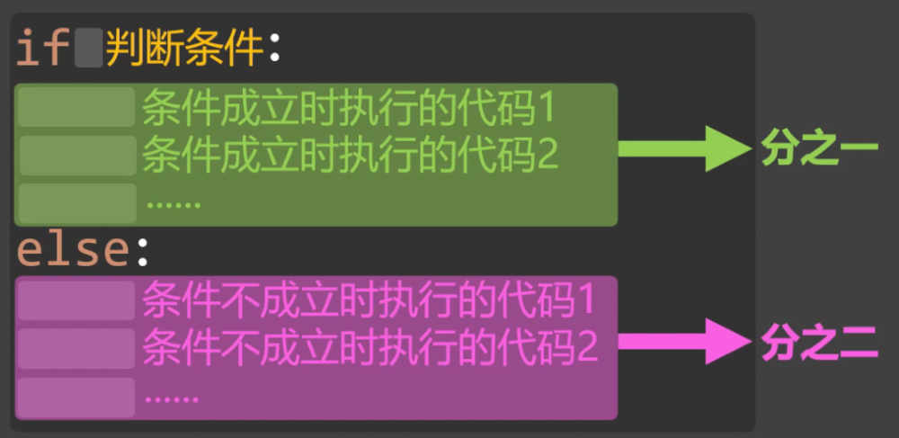
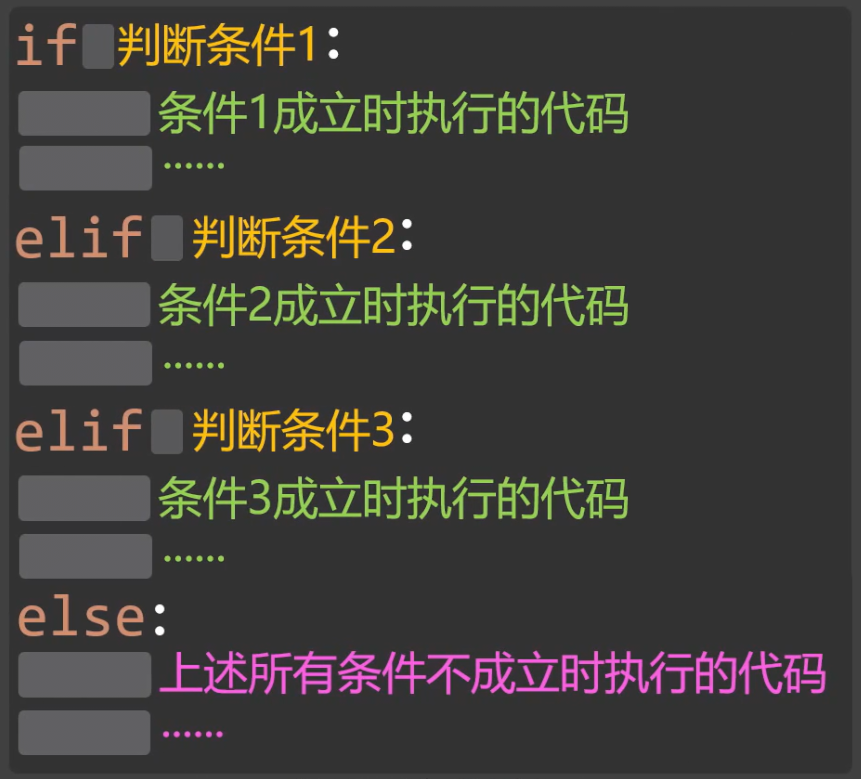
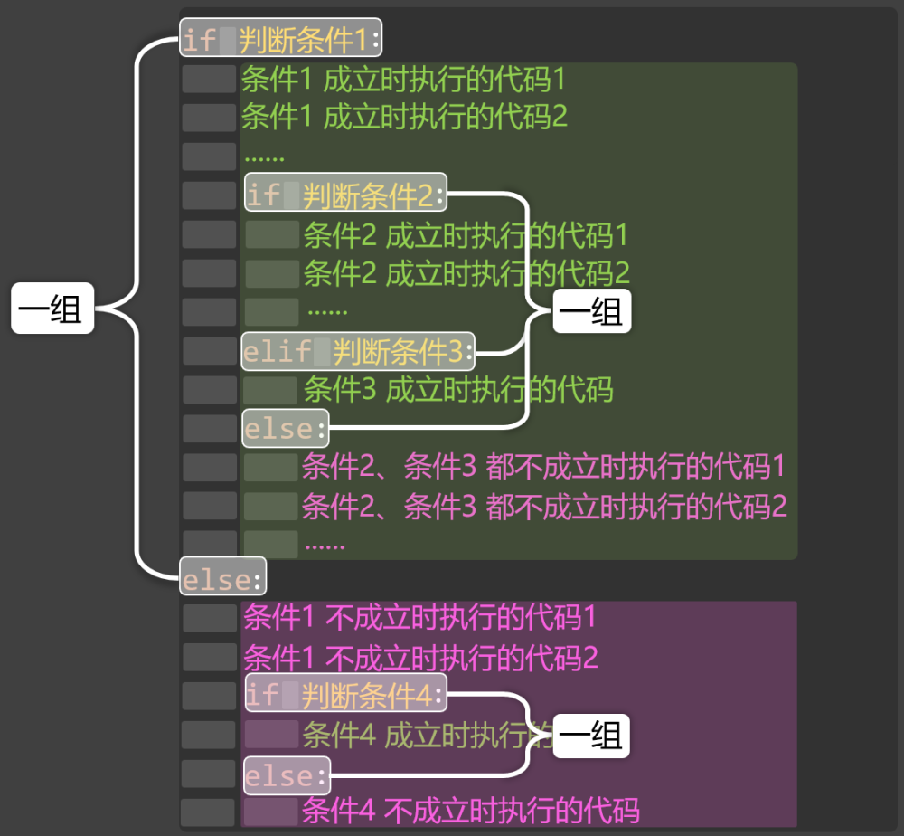
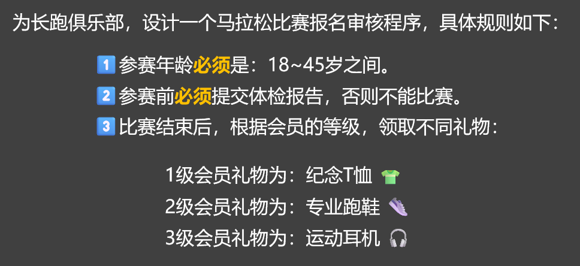

# 1. 分之

分支有很多其他的称呼，比如：条件控制语句、分支语句、选择语句。

分之是通过条件判断，来决定执行哪些代码。

## 1.1. 单分支

1️⃣语法格式：

```
if 判断条件:
    条件【成立】时执行的代码1
    条件【成立】时执行的代码2
    ......
```

2️⃣语法图解：



⚠️注意：Python 靠代码缩进来识别代码范围，所以条件成立时要执行的代码前，必须加空格。

3️⃣示例代码：

```
age = int(input('请输入你的年龄：'))
if age >= 18:
    print('你是成年人')
    print('成年人的世界，虽不容易，但很精彩！')
print('欢迎你来学习Python！')
```

## 1.2. 双分支

1️⃣语法格式：

```
if 判断条件:
    条件【成立】时执行的代码1
    条件【成立】时执行的代码2
else:
    条件成【不成立】时执行的代码1
    条件成【不成立】时执行的代码2
```

2️⃣语法图解：



3️⃣示例代码：

```
age = int(input('请输入你的年龄：'))
if age >= 18:
    print('你是成年人')
    print('成年人的世界，虽不容易，但很精彩！')
else:
    print('你是未成年人')
    print('好好加油，努力学习，未来可期！')
print('欢迎你来学习Python！')
```

## 1.3. 多分支

1️⃣语法格式：

```
if 判断条件1:
    条件1【成立】时执行的代码
elif 判断条件2:
    条件2【成立】时执行的代码
elif 判断条件3:
    条件3【成立】时执行的代码
else:  # else如不需要可以省略
    上述所有条件都不成立时执行的代码
```

2️⃣语法图解：



3️⃣示例代码：

```
# 根据年龄来判断处于人生哪个阶段。
age = int(input('请输入你的年龄：'))
if age <= 10:
    print('你是幼儿')
elif age <= 18:
    print('你是青少年')
elif age <= 30:
    print('你是青年')
elif age <= 50:
    print('你是中年')
elif age <= 60:
    print('你是中老年')
else:
    print('你是老年')
```

使用多分支语句时，需要注意下面几点：

一个if语句只能匹配1个else语句，但可以匹配多个elif语句，并且else语句要在所有的elif语句之后。

一旦某个分支语句检测为true，其他的elif以及else语句都将不再执行。

## 1.4. 嵌套分之

1️⃣语法格式：

```
if 判断条件1:
    # 条件1 成立时执行的代码1
    # 条件1 成立时执行的代码2
    # ......
    if 判断条件2:
        # 条件2 成立时执行的代码1
        # 条件2 成立时执行的代码2
        # ......
    elif 判断条件3:
        # 条件3 成立时执行的代码
        # ......
    else:
        # 条件2、条件3 都不成立时执行的代码1
        # 条件2、条件3 都不成立时执行的代码2
        # ......
else:
    # 条件1 不成立时执行的代码1
    # 条件1 不成立时执行的代码2
    # ......
    if 判断条件4:
        # 条件4 成立时执行的代码
        # ......
    else:
        # 条件4 不成立时执行的代码
        # ......
```

2️⃣语法图解：



3️⃣案例：



```
age = int(input('请输入你的年龄：'))
has_report = input('您是否提交了体检报告？（是/否）')
level = int(input('请输入你的会员等级（1/2/3）'))

print('******⬇️程序的识别结果如下⬇️：******')
if 18 <= age <= 45:
    print('✅️您的年龄符合比赛要求！')
    if has_report == '是':
        print('✅️您已提交体检报告！')
        print('✅️您可以参加比赛！')
        if level == 1:
            print(f'😊尊敬的{level}会员，比赛结束后，您可以领取纪念T恤👕一件！')
        elif level == 2:
            print(f'😊尊敬的{level}会员，比赛结束后，您可以领取专业跑鞋👟一双！')
        elif level == 3:
            print(f'😊尊敬的{level}会员，比赛结束后，您可以领取运动耳机🎧️一副！')
        else:
            print('❌您输入的会员等级不正确！')
    elif has_report == '否':
        print('❌您未提交体检报告，不能参加比赛！')
    else:
        print('❌您输入的体检报告有误！')
else:
    print('❌抱歉，参赛年龄需要在18~45之间！')
```
