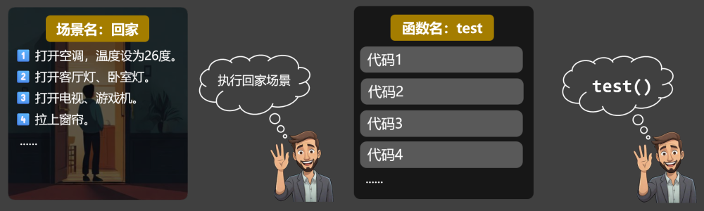
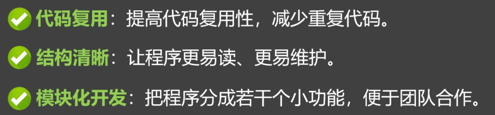
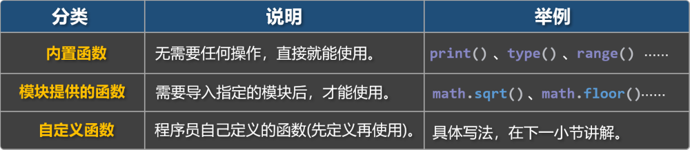

# 1. 概念及分类

## 1.1. 函数的概念

函数（function）是：组织好的、可重复使用的、用于执行特定任务的代码块。

🌰举个生活中的例子：

函数就像是智能家居中的一个场景，我们提前配置好场景中要执行的操作，等需要时，直接呼唤场景的名字，场景中的操作就会开始执行。

Python 中的函数是一段有名字的代码块，我们提前编写好函数中要执行的代码，等需要时，调用函数，函数中的代码就会执行。

智能家居场景 VS 函数

使用函数的主要优势：

## 1.2. Python 中函数的分类

Python 中函数分为三类：①内置函数、②模块提供的函数、③自定义函数。

相关官方文档：

内置函数：https://docs.python.org/zh-cn/3.13/library/functions.html

模块提供的函数：https://docs.python.org/zh-cn/3.13/py-modindex.html

📋备注：

内置函数与模块提供的函数， Python 都已经提前定义完毕，我们只管调用即可。

本章主要讲解自定义函数，对于内置函数和模块提供的函数，后面用到哪个讲哪个。
