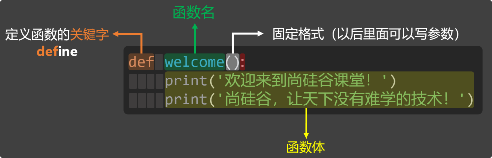
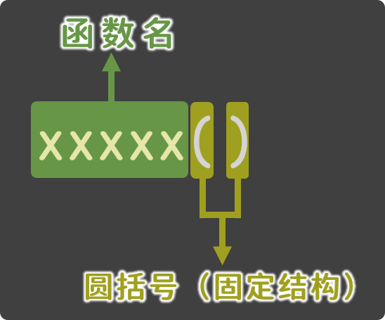

# 2. 基本使用

## 2.1. 定义函数

1️⃣语法格式：

如下语法格式是函数的基本定义，不涉及：接收参数和返回值。

```
def 函数名():
    函数体
    函数体
```

2️⃣语法图解：



3️⃣说明：

定义函数的关键字是def，需要将def与函数名用空格隔开，随后紧跟():。

函数的命名遵循我们之前讲过的『标识符命名规范』。

函数定义完毕后，只是告诉 Python 我们定义了一个函数，可以完成某些功能，但此时函数体还没有执行，需要调用函数后，函数体才会执行！

4️⃣示例代码：定义一个名为 welcome 的函数，函数体中打印两句欢迎语。

```
# 定义函数
def welcome():
    print('欢迎来到尚硅谷课堂！')
    print('尚硅谷，让天下没有难学的技术！')
```

## 2.2. 调用函数

1️⃣语法格式：

如下语法格式是基本调用形式，不涉及：传递参数。

```
函数名()
```

2️⃣语法图解：



3️⃣示例代码：编写代码，调用我们刚才定义的welcome函数。

```
# 定义函数
def welcome():
    print('欢迎来到尚硅谷课堂！')
    print('尚硅谷，让天下没有难学的技术！')

# 调用函数（让函数中的代码运行起来）
welcome()
welcome()
welcome()
```

⚠️注意：函数必须先定义再调用。
