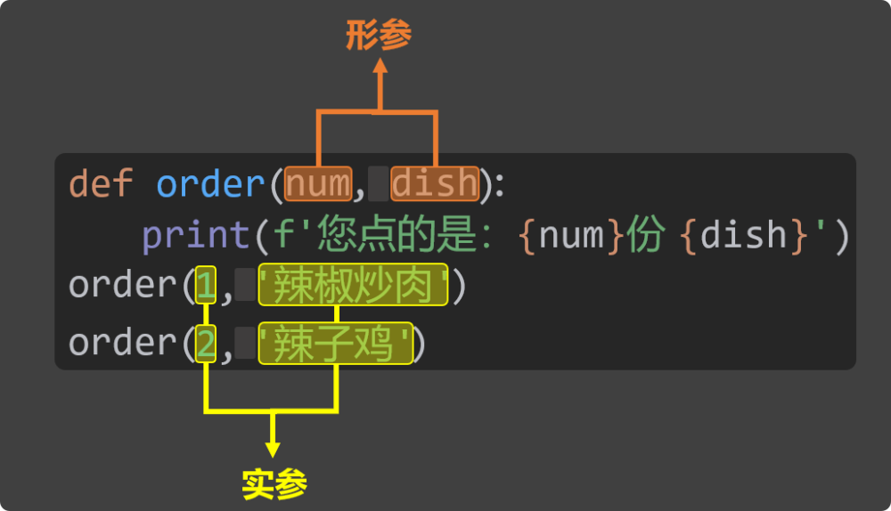
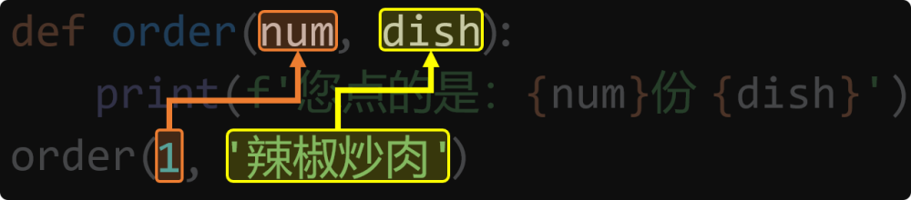

# 3. 参数

## 3.1. 参数的作用

参数可以让函数接收外部传入的数据，能让函数更具通用性和灵活性，比如下面的这个需求：

📒需求：定义一个名为order的函数，在函数体中打印用户的点餐信息。

用如下代码实现，就会面临两个问题：① 每次的点餐数量只能是一份。② 每次点的菜品只能是辣椒炒肉。

```
# 定义函数
def order():
    num = 1
    dish = '辣椒炒肉'
    print(f'您点的是：{num}份 {dish}')

# 调用函数
order()
```

但如果在上述代码的基础上，使用参数，就可以灵活修改点餐数量和菜品，写法如下：

```
# 定义函数（定义的同时：声明需要两个参数，分别是：菜品数量 num，和菜品名称 dish）
def order(num, dish):
    print(f'您点的是：{num}份 {dish}')
    print(f'{dish}可是很好吃的！')
    print(f'你只点了{num}份，够吃吗？\n')

# 调用函数（调用的同时：传递了两个值）
order(1, '辣椒炒肉')
order(2, '辣子鸡')
```

## 3.2. 实参与形参

在使用函数时，要注意区分『形参』与『实参』。

形参（形式参数）：在定义函数时，用来接收数据的变量叫形参，形参是函数定义者设置的。

实参（实际参数）：在调用函数时，给函数传递的具体值叫实参，实参是函数调用者提供的。



📋备注：形参存储的到底是什么数据，要看调用者传递的实参具体是什么。

📢注意：形参的使用范围仅限函数体内。

## 3.3. 位置参数

位置参数：调用函数时，根据参数在函数定义时出现的顺序，把实参的值，依次传递给对应的形参。

例如在上一小节所写的order函数，就是在使用位置参数，其中形参与实参的对应关系如下图：



📢注意：在使用『位置参数』时，实参的个数与顺序，必须和形参保持一致！

```
def order(num, dish):
    print(f'您点的是：{num}份 {dish}')
    print(f'{dish}可是很好吃的！')
    print(f'你只点了{num}份，够吃吗？\n')

# 以下是错误示范
order(3)  # 参数少了
order(4, '宫保鸡丁', 7)  # 参数多了
order('宫保鸡丁', 4)  # 实参顺序没有和形参保持一致，不会报错，但会造成数据错乱。
```

## 3.4. 关键字参数

关键字参数：函数调用时通过形参名 = 值的形式传递的参数，就是关键字参数。

关键字参数的优势是：不受顺序限制。

```
# 定义函数
def greet(name, gender, age, height):
    print(f'我叫{name}，性别{gender}，年龄是{age}，身高是{height}cm')

# 调用函数（使用关键字参数）
greet(name='张三', gender='男', age=18, height=172)
greet(height=172, age = 18, gender='男', name='张三')
```

📢注意：『位置参数』和『关键字参数』可以混用，但『位置参数』必须写在『关键字参数』之前！

```
# 正确使用方式
greet('张三', '男', height=172, age=18)

# 错误示例
greet(height=172, age=18, '张三', '男')
greet(name='张三', '男', 18, 172)
greet(name='张三', '男', age=18, 172)
greet(height=172, age=18, gender='男', name='张三', age=19)
greet(height=172, age=18, gender='男', name='张三', school='尚硅谷')
```

## 3.5. 限制传参方式

具体限制方式：/前面只能用『位置参数』，*后面只能用『关键字参数』。

```
# 定义函数（使用/和*限制传参方式）
def greet(name, /, gender, *, age, height):
    print(f'我叫{name}，性别{gender}，年龄是{age}，身高是{height}cm')

# 正确示例
greet('张三', '男', age=18, height=172)
greet('张三', gender='男', age=18, height=172)

# 错误示例
greet(name='张三', gender='男', age=18, height=172)
greet('张三', '男', 18, height=172)
```

## 3.6. 参数默认值

在定义函数时，可以通过形参名 = 值的形式，为形参设置一个默认值，这样就可以实现：

若调用函数时没有传入该参数的值，就使用默认值。

若调用函数时传入了该参数的值，就使用传入的值。

```
# 定义函数（设置参数默认值）
def greet(name, gender, age, height, msg='你好'):
    print(f'我叫{name}，性别{gender}，年龄是{age}，身高是{height}cm')
    print(f'我想说：{msg}')
    
# 调用函数
greet('张三', '男', 18, 172)
greet('张三', '男', 18, 172, 'hello')
greet('张三', '男', 18, 172, msg='hello')
```

📢注意：定义函数时，『默认参数』必须放在『必选参数』的后面，或者换一种说法就是：某个形参，一旦设置了默认值，那它后面的所有形参，也必须要写默认值！

例如：下面的代码中，msg='你好'这个默认参数，居然写在了位置参数height前面，所以就会报错。

```
# 定义函数（设置参数默认值的错误示例）
def greet(name, gender, age,  msg='你好', height):
    print(f'我叫{name}，性别{gender}，年龄是{age}，身高是{height}cm')
    print(f'我想说：{msg}')
```

## 3.7. 可变参数

在定义函数时，如果不确定会传入多少个参数，那就可以使用可变参数，具体写法有两种：

使用*形参名来接收任意数量的『位置参数』，多个位置参数最终会被打包成一个『元组』。

使用**形参名来接收任意数量的『关键字参数』，多个关键字参数最终会被打包成一个『字典』。

📋备注：元组和字典都是新的数据类型，后面才会讲，但没关系，这不耽误大家理解本小节的内容。

```
# 定义函数（使用*args去接收：可变位置参数，args只是大家习惯这么写，当然也可以换成其他变量）
def test1(*args):
    # 此处args的值，是一种新的数据类型，叫：元组，我们下一章就去讲元组
    print(args)

# 调用函数
test1('张三', '男', 18, 172)
# 定义函数（使用**kwargs去接收：可变关键字参数，kwargs只是大家习惯这么写，当然也可以换成其他变量）
def test2(**kwargs):
    # 此处kwargs的值，是一种新的数据类型，叫：字典，我们下一章就去讲字典
    print(kwargs)

# 调用函数
test2(name='张三', gender='男', age=18, height=172)
```

💡『可变位置参数』和『可变关键字参数』，可以同时使用，但必须要先写『可变位置参数』。

```
# 定义函数（同时使用：可变位置参数、可变关键字参数）
def test3(a, b, *args, c='尚硅谷', **kwargs):
    print(a)
    print(b)
    print(c)
    print(args)
    print(kwargs)
# 调用函数
test3('张三', '男', '抽烟', '喝酒', age=18, height=172)
```

## 3.8. 特殊的字面量 None

None 是一个特殊的字面量，用来表示：空值、无值、无意义。

例如：msg = None 的含义是 —— 我先定义一个变量 msg，但目前还不知道它会存储什么类型的值，那能不能写成 msg = 0 呢？这要看具体情况：

如果确定 msg 之后会存放数值类型的数据，那这样写是可以的。

但如果还不确定 msg 将来会存放什么类型的数据，最好不要写成 msg = 0，否则可能会误导别人以为它一定是数值类型。

所以使用 None 更加中立、开放，因为它不暗示变量的类型。

None 的官方文档：https://docs.python.org/zh-cn/3.13/library/constants.html#None

💡几个关键点：

None的类型是NoneType。

None出现在布尔判断中(if判断条件、while循环条件)，会被当作False来处理。

None不能参与任何数学运算，也不能与字符串拼接。

不给函数设置返回值，那函数默认就会返回None

None出现最多的两个场景：

1️⃣函数中没有写return，或写了return但没有返回任何内容 。

2️⃣变量定义时，暂时还不知道要存放什么，可以先赋值为None。

```
# None是一个特殊的字面量，它表示：空值 / 无值 / 无意义。
msg = None

# None 的类型是 NoneType。
print(type(msg))

# None 转为布尔值是 False。
print(bool(msg))
if not msg:
    print('你好')

# 不能参与数学运算，也不能与字符串拼接。
# result1 = msg + 1
# result1 = msg + 'hello'
```
