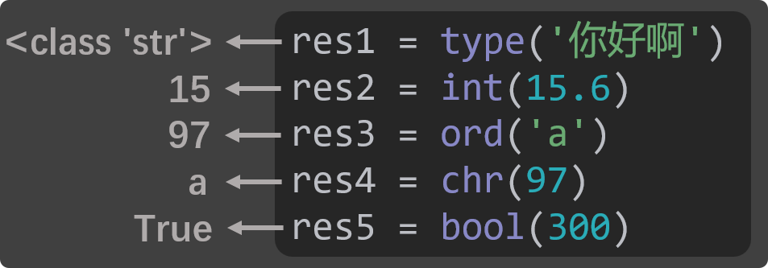

# 4. 返回值

## 4.1. 什么是返回值

函数返回值：函数执行完毕后，会把执行结果交给调用者，这个执行结果就是函数的返回值。

我们之前用过的这些内置函数，都有返回值：



对于自定义的函数，即便我们不去设置返回值，函数也会默认返回None，由于None表示空，所以如果一个函数的返回值是None的话，就也可以说：这个函数“没有”返回值。

```
# 定义函数
def add(n1, n2):
    print(f'我收到了：{n1}、{n2}，二者相加是：{n1 + n2}')
    print('add函数执行完毕了')

# 调用函数
result = add(100, 200)
print(result)  # None
```

## 4.2. 如何设置返回值

使用return关键字可以设置函数的返回值，return的作用有两个，分别是：

结束函数的运行。

把return后面的值，作为函数的返回值。

```
# 定义函数
def add(n1, n2):
    print(f'我收到了：{n1}、{n2}，二者相加是：{n1 + n2}')
    print('add函数执行完毕了')
    return n1 + n2

# 调用函数
result = add(100, 200)
print(result)

# print函数是没有返回值的
res = print('hello')
print(res)
```
