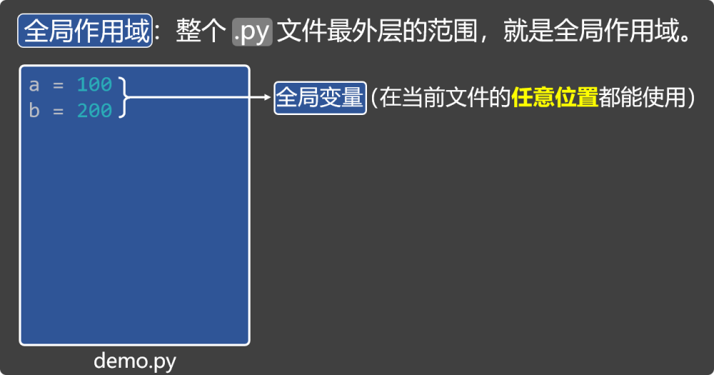
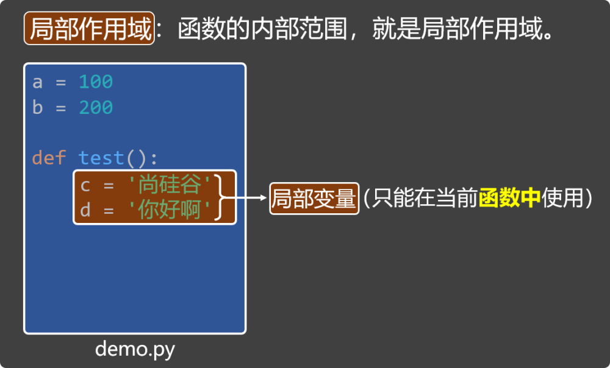

# 5. 全局作用域 VS 局部作用域

## 5.1. 什么是作用域？

作用域就是变量能起作用的范围（变量在哪里能用，在哪里不能用），Python 中有多种作用域，我们先来学习：全局作用域、局部作用域。

## 5.2. 全局作用域 _ 全局变量

全局作用域：整个.py文件最外层的范围，就是全局作用域。

全局变量：写在全局作用域中的变量，就叫：全局变量，全局变量在整个程序中都可以访问。



## 5.3. 局部作用域 _ 局部变量

局部作用域：函数的内部范围，就是局部作用域。

局部变量：写在局部作用域中（函数内部）的变量，叫：局部变量，它只能在当前函数中使用。



## 5.4. global 关键字

在函数内部使用global关键字，可以声明变量为全局变量。

```
a = 100

def test():
    global a  # 使用 global 关键字，将a声明为全局变量。
    a = 300
    print('函数中的打印（a）', a)
test()
print('全局的打印（a）', a)
```

## 5.5. 小测试

请说出如下代码的输出结果（具体分析请参考视频教程）

```
# 全局作用域 与 局部作用域，以及global的使用
a = 100
b = 200

def test():
    c = '尚硅谷'
    d = '你好啊'
    global a
    a = 300
    print('函数中的打印（a）', a)
    print('函数中的打印（b）', b)
    print('函数中的打印（c）', c)
    print('函数中的打印（d）', d)
test()
print('***************')
print('全局的打印（a）', a)
print('全局的打印（b）', b)
print(c)
print(d)


# 局部作用域 和 局部变量，会在函数调用时创建，在函数执行结束后自动销毁
def test2():
    m = 100
    m += 1
    print(f'我是test2函数中打印的m：{m}')
test2()
test2()
test2()


# 全局作用域 与 全局变量，会在程序开始时创建，在程序结束后销毁
n = 100
def test3():
    global n
    n += 1
    print(f'我是test3函数中打印的n：{n}')
test3()
test3()
test3()
print(n)
```
