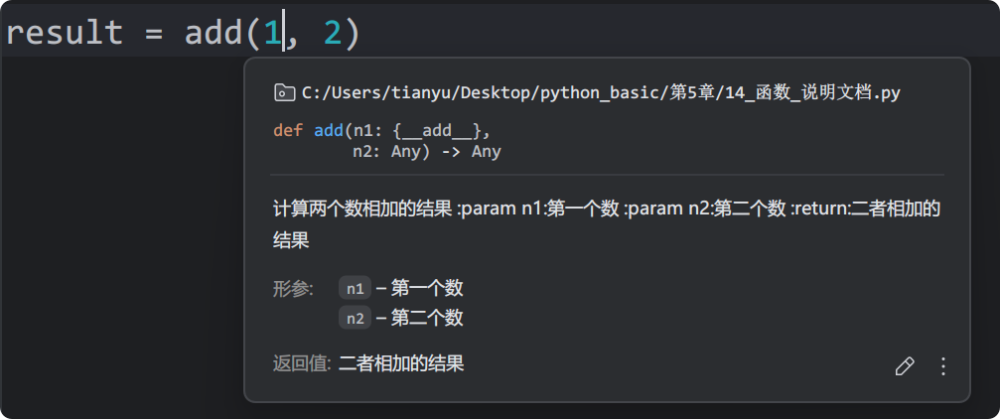

# 8. 函数说明文档

函数说明文档：写在函数里的文字说明，用来描述：函数的功能、需要哪些参数、返回什么结果，它的语法和普通字符串一样，用三引号包裹：

```
def add(n1, n2):
    """
    计算两个数相加的结果
    :param n1:第一个数
    :param n2:第二个数
    :return:二者相加的结果
    """
    return n1 + n2

result = add(1, 2)
```

有了函数说明文档之后，可以通过鼠标悬浮的方式，查看函数的具体信息，如下图：


