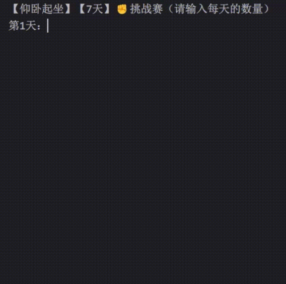

# 9. 函数综合案例

完成一个健身挑战赛程序，功能演示见下图：



具体实现代码如下：

如下代码的具体分析过程，请参考视频教程。

```
def calc_total(*nums):
    """
    计算总运动量（个）
    :param nums: 每一天的运动量（可变参数）
    :return: 总运动量（个）
    """
    # 备注：nums的类型是元组（下一章马上就讲了），sum是内置函数，可以对元组中的数据求和
    return sum(nums)

def calc_avg(total, days=7):
    """
    计算平均值
    :param total: 总运动量（个）
    :param days: 天数（默认值是7）
    :return: 平均值
    """
    return total / days

def check_success(total, goal=120):
    """
    判断本次挑战是否成功
    :param total: 总运动量
    :param goal: 成功数量（默认值为120）
    :return: 成功或失败的具体信息
    """
    if total >= goal:
        return '✅恭喜！挑战成功！'
    else:
        return '❌抱歉！挑战失败！'

def main(title, duration, goal):
    """
    主函数，用于开始一场挑战赛
    :param title: 比赛标题
    :param duration: 比赛持续天数
    :param goal: 目标运动量
    :return: None
    """
    print(f'【{title}】【{duration}天】✊️挑战赛（请输入每天的数量）')
    num1 = int(input('第1天：'))
    num2 = int(input('第2天：'))
    num3 = int(input('第3天：'))
    # 计算总数
    total = calc_total(num1, num2, num3)
    # 计算平均值
    avg = calc_avg(total, duration)
    # 判断挑战是否成功
    result = check_success(total, goal)
    # 打印相关信息
    print(f'【{title}】【{duration}天】健身总结')
    print(f'总数：{total}，平均值：{avg:.1f}')
    print(result)

main('俯卧撑', 3, 40)
```
