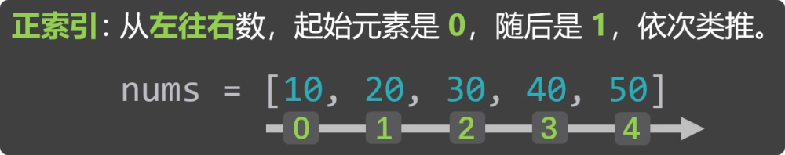
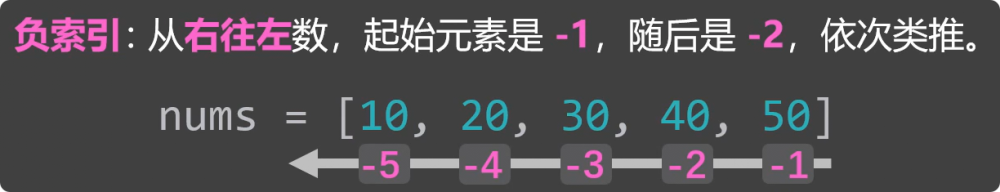
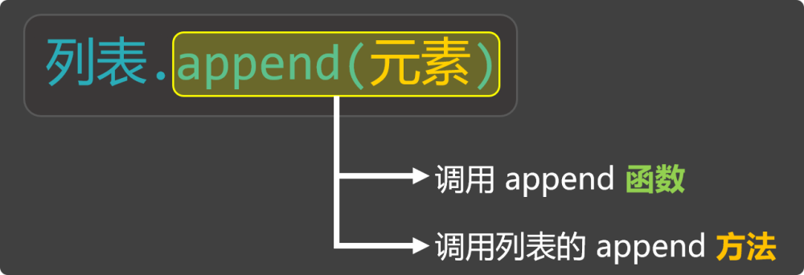
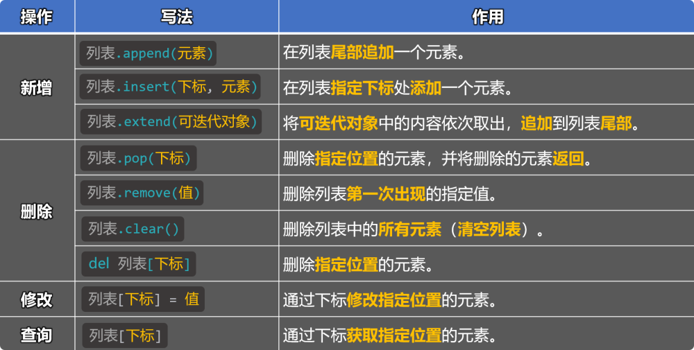
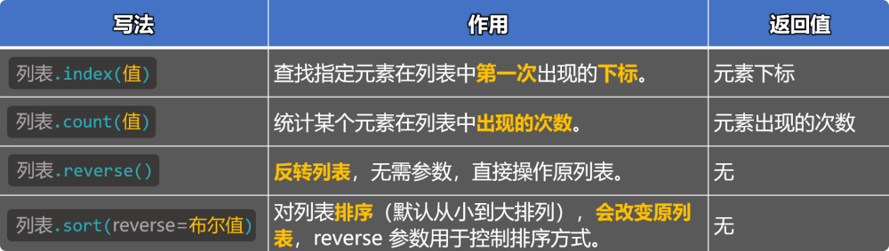
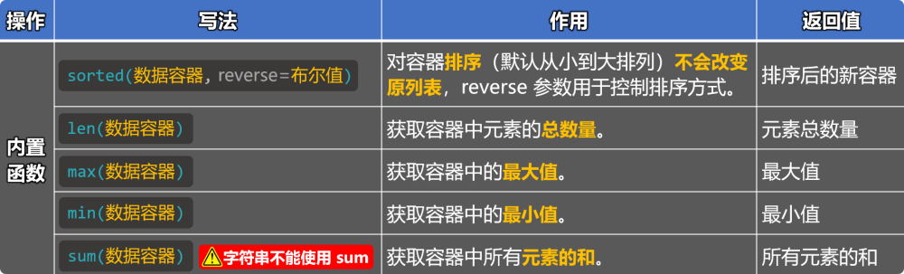
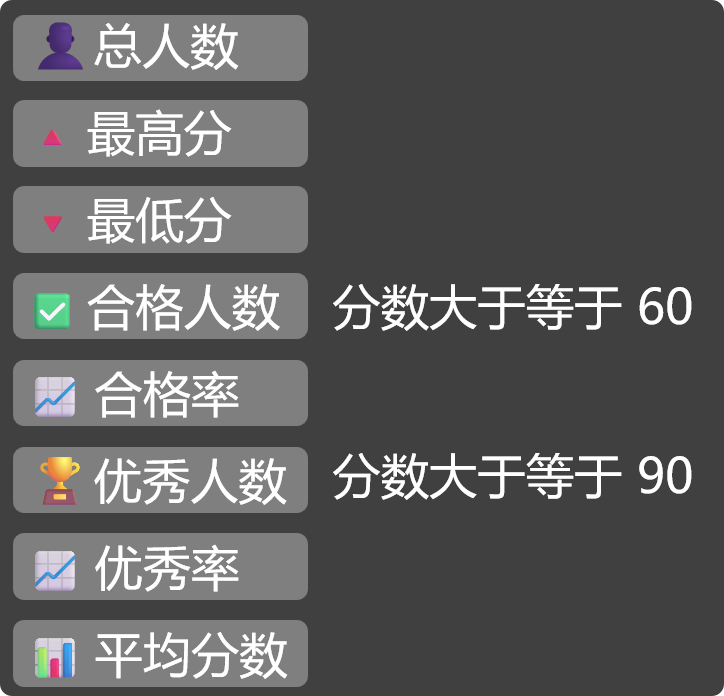

# 2. 列表

## 2.1. 概述

列表：用来存放一组有序的数据，并且可以对其中的数据进行：增删改查。

列表就像一个长度可变的收纳盒，能按顺序装下多个元素，还可以随时添加、拿出、替换里面的元素。

## 2.2. 定义列表

使用方括号[]来定义一个列表，不同元素之间用,去分隔。


```
# 定义有内容的列表
list1 = [34, 56, 21, 56, 11]
list2 = ['北京', '尚硅谷', '你好啊']
list3 = [23, '尚硅谷', True, None]
list4 = [23, '尚硅谷', True, None, [100, 200, 300]] # list4 是一个嵌套列表

# 定义空列表（列表中的数据，后期会通过特定写法填充）
list5 = []
list6 = list()

print(list1, type(list1))  # [34, 56, 21, 56, 11] <class 'list'>
print(list2, type(list2))  # ['北京', '尚硅谷', '你好啊'] <class 'list'>
print(list3, type(list3))  # [23, '尚硅谷', True, None] <class 'list'>
print(list4, type(list4))  # [23, '尚硅谷', True, None, [100, 200, 300]] <class 'list'>
print(list5, type(list5))  # [] <class 'list'>
print(list6, type(list6))  # [] <class 'list'>
```

## 2.3. 下标（索引值）

下标又叫索引值，其实就是元素在列表中的“位置编号”，分为：『正索引』、『负索引』。



正索引



负索引

下标最直接的用途就是：从列表中读取元素。

```
# 定义一个列表
nums = [10, 20, 30, 40, 50]

# 测试正索引
print(nums[0])  # 10
print(nums[1])  # 20
print(nums[2])  # 30
print(nums[3])  # 40
print(nums[4])  # 50

# 测试负索引
print(nums[-1])  # 50
print(nums[-2])  # 40
print(nums[-3])  # 30
print(nums[-4])  # 20
print(nums[-5])  # 10

# 测试错误索引
print(nums[5]) 

# 定义一个嵌套列表
nums2 = [10, 20, ['你好啊','尚硅谷'], 40, 50]
# 取出“尚硅谷”
print(nums2[2][1])  # 尚硅谷
```

📢注意：通过下标取值时，下标不要超出范围，否则会报错。

## 2.4. 列表的增删改查

我们先来认识一个名词 —— 『方法』，先来看如下的这种写法：


在上述写法中，如果只看append(元素)，这就是在调用append函数，但append前面还有列表.这种形式，所以也可以换一个说法，叫：调用列表的append方法。



那方法和函数之间是什么关系呢？从更正式的角度来说：当一个函数隶属于某个对象时，这个函数就被称为该对象的方法。不过对于初学者来说，这句话可能一时还不好理解，因为我们尚未学习“类”和“对象”等相关内容。所以这里大家暂时不必纠结方法的严格定义，只要先理解下面这种写法的含义即可：

b()：这叫调用b函数。

a.b()：这叫调用a的b方法。

📢注意：a.b()的形式不是随便写的，a如果是数字100，那就不可以写a.b()，因为这么写的前提是a的身上，得确实有b方法才可以。

列表的增删改查方法概览：



### 1️⃣新增

列表的新增指的是：向列表中添加元素，主要有如下三种添加方式：

方式1：使用：列表.append(元素)，在列表尾部追加一个元素。

```
# 方式一：通过列表的append方法，在列表尾部追加一个元素
nums = [10, 20, 30, 40]
nums.append(50)
print(nums)  # [10, 20, 30, 40, 50]
```

方式2：使用：列表.insert(元素)，在指定下标处添加一个元素。

```
# 方式二：通过列表的insert方法，在列表的指定下标处添加一个元素
nums = [10, 20, 30, 40]
nums.insert(2, 666)
print(nums)  # [10, 20, 666, 30, 40]
```

方式3：使用：列表.extend(可迭代对象)，将可迭代对象中的内容依次取出，追加到列表尾部。

```
# 方式三：通过列表的extend方法，将可迭代对象中的内容依次取出，追加到列表尾部
nums = [10, 20, 30, 40]
nums.extend('尚硅谷')
nums.extend(range(1, 4))
nums.extend([70, 80, 90])
print(nums)  # [10, 20, 30, 40, '尚', '硅', '谷', 1, 2, 3, 70, 80, 90]
```

### 2️⃣删除

主要有如下四种删除方式：

方式1：使用：列表.pop(下标)，删除指定位置的元素，并将删除的元素返回。

```
# 方式一：通过列表的pop方法，删除指定位置的元素，并返回该元素
nums = [10, 20, 10, 40, 50]
result = nums.pop(1)
print(nums)   # [10, 10, 40, 50]
print(result) # 20
```

方式2：使用：列表.remove(值)，删除列表中第一次出现的指定值。

```
# 方式二：通过列表的remove方法，删除列表中第一次出现的指定值
nums = [10, 20, 10, 40, 50]
nums.remove(10)
print(nums)
```

方式3：使用：列表.clear()，删除列表中所有的元素（变成一个空列表）。

```
# 方式三：通过列表的clear方法，删除列表中所有的元素（清空列表）
nums = [10, 20, 10, 40, 50]
nums.clear()
print(nums)  # [20, 10, 40, 50]
```

方式4：使用：del 列表[下标]，删除指定位置的元素。

```
# 方式四：通过del关键字，删除指定元素
nums = [10, 20, 10, 40, 50]
del nums[3]
print(nums)  # [10, 20, 10, 50]
```

### 3️⃣修改

修改操作比较简单，主要是通过下标进行修改，语法为：列表[下标] = 值

```
# 修改操作
nums = [10, 20, 10, 40, 50]
nums[2] = 66
print(nums)  # [10, 20, 66, 40, 50]
```

### 4️⃣查询

查询我们之前已经用过了，就是通过下标进行读取元素，语法为：列表[下标]

```
# 查询操作
nums = [10, 20, 10, 40, 50]
print(nums[3]) # 40
```

## 2.5. 列表的常用方法

除了上述的增删改查方法，列表中还有很多其他常用的方法：



1️⃣使用：列表.index(值)，查找指定元素在列表中第一次出现的下标，返回值是元素下标。

```
fruits = ['香蕉', '苹果', '橙子', '香蕉']
result = fruits.index('香蕉')
print(result)  # 0
```

2️⃣使用：列表.count(值)，统计某个元素在列表中出现的次数，返回值是：元素出现的次数。

```
nums = [10, 20, 10, 30, 10, 40, [10, 10, 10]]
result = nums.count(10)
print(result)  # 3
```

3️⃣使用：列表.reverse()，反转列表（会改变原列表），无需参数，无返回值。

```
nums = [23, 11, 32, 30, 17, [6, 7, 8, 9]]
nums.reverse()
print(nums)  # [[6, 7, 8, 9], 17, 30, 32, 11, 23]
```

4️⃣使用：列表.sort(reverse=布尔值)，对列表排序（从小到大，会改变原列表），reverse 用于控制排序方式，无返回值。

```
# 4.使用 sort 方法，对列表排序（默认从小到大），若想从大到小，可以将 reverse 参数设为True。
# 4.1 若列表中的元素：都是数字，则按照数字的大小顺序进行排序。
nums = [23, 11, 32, 30, 17]
nums.sort(reverse=True)
print(nums)  # [32, 30, 23, 17, 11]

# 4.2 若列表中的元素：既有数字，又有字符串，那就会报错。
nums = [23, 11, 32, 30, 17, '尚硅谷']
nums.sort()
print(nums) # [23, 11, 32, 30, 17, '尚硅谷']

# 4.3 若列表中的元素：都是字符串，则按照字符串的 Unicode 编码大小进行排序
msg_list = ['北京', '北硅谷', '北好']
msg_list.sort()
print(msg_list)  # ['北京', '北好', '北硅谷']
print(ord('京'), ord('好'), ord('硅'))  # ['北京', '北好', '北硅谷']

# 备注：所有的列表方法，都只作用于“当前层”的元素（浅层操作），不会自动进入嵌套的“里层”结构中。
```

## 2.6. 列表的常用内置函数

Python 中有一些内置函数，可以用来处理列表，常用的几个如下：



📢注意：✅️上述内置函数，不仅适用于列表，而是适用于：所有的数据容器。

1️⃣sorted(数据容器, reverse=布尔值)，对容器排序（从小到大，不会改变原容器），返回值：经过排序的新容器。

```
# 1.使用内置的 sorted 函数，返回一个排序后的新容器（不改变原容器，默认顺序：从小到大）
# 1.1 若列容器中的元素：都是数字，则按照数字的大小顺序进行排序。
nums = [23, 11, 32, 30, 17]
result = sorted(nums, reverse=True)
print(nums)   # [23, 11, 32, 30, 17]
print(result) # [32, 30, 23, 17, 11]

# 1.2 若列容器中的元素：既有数字，又有字符串，那就会报错。
nums = [23, 11, 32, 30, 17, '尚硅谷']
sorted(nums)

# 1.3 若列容器中的元素：都是字符串，则按照字符串的 Unicode 编码大小进行排序。
msg_list = ['北京', '尚硅谷', '你好']
result = sorted(msg_list)
print(msg_list)  # ['北京', '尚硅谷', '你好']
print(result) # ['你好', '北京', '尚硅谷']
```

2️⃣len(数据容器)，获取容器中元素的个数，返回值：元素个数。

```
# 2.使用内置的 len 函数，获取容器中元素的总数量，返回值是：元素总数量。
nums = [10, 20, 10, 30, 10, 40, [50, 60, 70]]
result = len(nums)
print(result) # 7
```

3️⃣max(数据容器)，返回容器中 或 多个值中的最大值，返回值：容器中的最大值。

```
# 3.使用内置的 max 函数，获取容器中的最大值，返回值是：最大值。
# 3.1 如果容器中的元素：都是数字，那 max 返回的是最大的数。
nums = [23, 11, 32, 30, 17]
result = max(nums)
print(nums) # [23, 11, 32, 30, 17]
print(result) # 32

# 3.2 如果容器中的元素：既有数字又有字符串，那 max 会报错。
nums = [23, 11, 32, 30, 17, '尚硅谷']
max(nums)

# 3.3 如果容器中的元素：都是字符串，那 max 会返回：Unicode 编码最大的字符。
msg_list = ['北京', '尚硅谷', '你好']
result = max(msg_list)
print(msg_list)  # ['北京', '尚硅谷', '你好']
print(result)  # 尚硅谷

# 3.4 max 函数也可以接收多个值，并筛选出最大值
result = max(33, 45, 12, 78, 99)
print(result) # 99
```

4️⃣min(数据容器)，返回容器中 或 多个值中的最小值，返回值：容器中的最小值。

```
# 4.使用内置的 min 函数，获取容器中的最小值，返回值是：最小值。
# 备注：min 函数的使用方式与注意点与 max 函数一样，只不过 min 函数返回的是最小值
nums = [23, 11, 32, 30, 17]
result = min(nums)
print(result) # 11
```

5️⃣sum(数据容器)，对容器中所有元素求和（只能是数值类型），返回值：所有元素的和。

```
# 5.使用内置的 sum 函数，对容器中的数据进行求和（元素只能是数值）。
nums = [10, 20, 30, 40, 50]
result = sum(nums)
print(result) # 150
```

## 2.7. 列表的循环遍历

所谓遍历，就是将列表的每个元素依次取出进行处理，代码如下：

```
# 定义一个成绩列表
score_list = [62, 50, 60, 48, 80, 20, 95]

# 使用while循环遍历列表
index = 0
while index < len(score_list):
    print(score_list[index])
    index += 1
# 使用for循环遍历列表
for item in score_list:
    print(item)

# 使用for循环遍历列表（通过range函数 和 len函数按照索引遍历）
for index in range(len(score_list)):
    print(score_list[index])
```

在上述遍历中，while循环需要结束条件，所以我们定义了index变量，所以打印时，就可以方便的借助index输出当前元素是第几个。

而for循环的遍历，不需要index，那如果也想打印元素是第几个，但又不想去定义index的话，可以借助enumerate这个内置函数，它可以在遍历时获取索引和值，代码如下：

```
# 使用for循环遍历列表（通过enumerate函数，同时获取下标（索引值）和元素）
# enumerate 的 start 参数，可以让计数从指定值开始（改变的是循环时的“编号”，不是真正的索引值）
for index, item in enumerate(score_list, start=5):
    print(index, item, score_list[0])
print('最后的打印', score_list[0])
```

## 2.8. 列表特点总结

可存放不同类型的元素。

元素是有序存储的（正索引、负索引）。

列表中的元素允许重复。

元素是允许修改的（增、删、改、查、其他操作）。

长度不固定，可以随着操作自动调整大小。

📍一句话总结：列表是最常用的数据容器，当遇到要“存储一批数据”的场景时，首选列表。

## 2.9. 列表小练习

需求：实现一个成绩统计程序，可以对多名学生的成绩，进行统计和分析。具体统计的项目如下图：



📋备注：用户可以连续输入学生成绩，直到用户输入“结束”字符串。

```
print('请输入学生成绩，输入“结束”停止录入')
score_list = []

# 持续循环，让用户输入学生成绩
while True:
    data = input('📝请输入成绩：')
    if data == '结束':
        break
    else:
        score_list.append(int(data))

# 如果score_list中有数据，则开始统计
if score_list:
    # 统计平均分
    avg = sum(score_list) / len(score_list)
    # 合格人数
    pass_count = 0
    # 优秀人数
    excellent_count = 0
    # 遍历列表，开始统计
    for item in score_list:
        if item >= 60:
            pass_count += 1
        if item >= 90:
            excellent_count += 1
    # 合格率
    pass_rate = pass_count / len(score_list) * 100
    # 优秀率
    excellent_rate = excellent_count / len(score_list) * 100
    # 打印信息
    print('********⬇️统计信息如下⬇️********')
    print(f'🧑‍🎓总人数为：{len(score_list)}')
    print(f'🔺最高分为：{max(score_list)}')
    print(f'🔻最低分为：{min(score_list)}')
    print(f'✅合格人数：{pass_count}人')
    print(f'📈合格率为：{pass_rate:.1f}%')
    print(f'🏆优秀人数：{excellent_count}人')
    print(f'📈优秀率为：{excellent_rate:.1f}%')
    print(f'📊平均分数：{avg:.1f}')
else:
    print('您没有输入任何成绩！')
```
