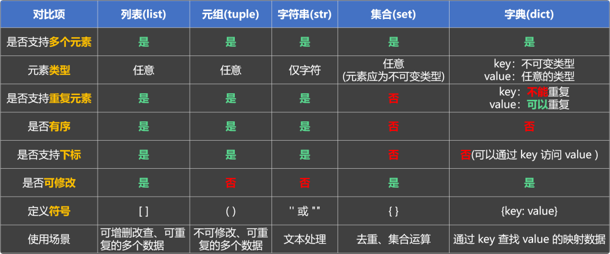

# 11. 数据容器_总结

有序与无序：

有序：列表(list)、元组(tuple)、字符串(str)—— 元素有顺序，可通过下标访问元素。

无序：集合(set)、字典(dict) —— 元素没有固定位置，不能用下标访问。

可修改：

可变：列表(list)、集合(set)、字典(dict) —— 可以对内容进行增、删、改操作。

不可变：元组(tuple) 、字符串(str) —— 内容固定，创建后无法修改。

可重复：

允许重复：列表(list) 、元组(tuple) 、字符串(str)

不允许重复：集合(set) 、字典(dict) 备注：字典的 key 是唯一的，但 value 可重复

