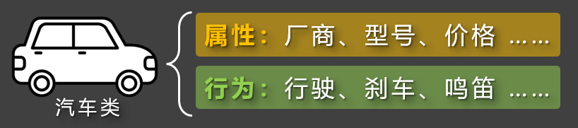
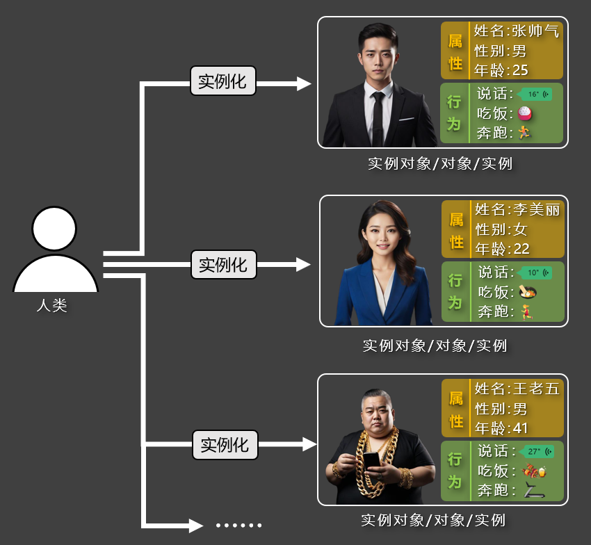
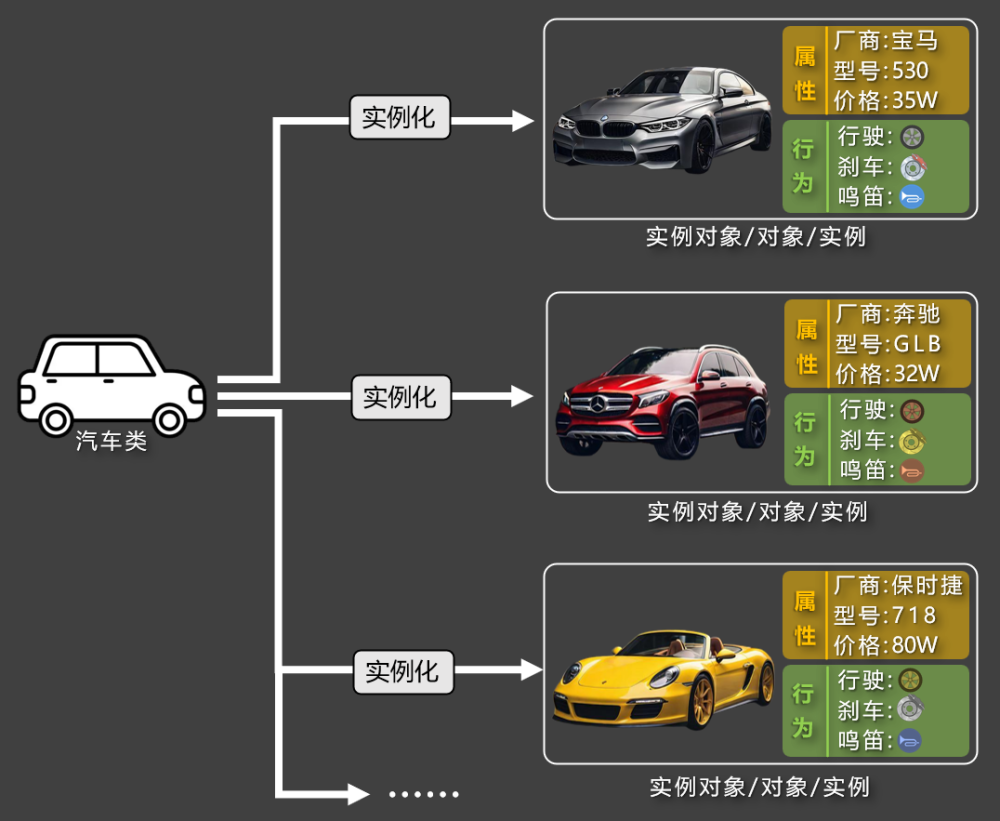

# 1. 概述

## 1.1. 对象

『对象』是一个拥有『属性』和『行为』的个体，它是构成现实世界和程序世界的基本单位。编程领域有这么一句话，叫“万物皆对象！”之所以这么说，是因为任何一个具体存在的人或物，都可以看成是一个对象，例如：一个人、 一辆车、一部手机，都是对象，他们的『属性』和『行为』分别是：

人的属性有：姓名、性别、年龄...... ，人的行为有：吃饭、睡觉、跑步......

车的属性有：品牌、颜色、价格...... ，车的行为有：启动、加速、刹车......

手机的属性有： 品牌、颜色、电量...... ，手机的行为有： 打电话、播放音乐、拍照......

## 1.2. 面向对象

『面向对象』是一种以对象为中心，去思考和组织代码的方式，它更关注：“谁来做这件事”。

以“做饭”这件事为例：

传统思想：关注“做饭的步骤”，会依次进行：洗菜 → 切菜 → 炒菜 → 装盘。

面向对象思想：关注“谁来做这件事”，会找『切菜员』来洗菜和切菜，找『厨师』来炒菜和装盘。

在上述描述中：『切菜员』和『厨师』就是对象，至于这些对象是我们自己编写的，还是来自外部模块，这并不重要。

面向对象思想的好处是：可扩展性强，『切菜员』能给我做菜，也能给别人做菜；能做简单的菜，也能做复杂的菜。在程序中也是这个道理：我们定义的“对象”，可以被复用，多个对象之间还可以协作，一起组成更大的系统。

## 1.3. 类

『类（class）』是用来描述一类事物的"模板"，它规定了一类事物所具有的『属性』和『行为』。

人类

汽车类

## 1.4. 实例 VS 实例化

1️⃣实例：根据『类』创建出来的一个具体的『对象』又称『实例』，也可称为『实例对象』。

对象、实例、实例对象，这三个词在日常使用中是同一个意思。

2️⃣实例化：所谓『实例化』就是根据类“制造出”一个对象的过程。

类是抽象的“模板”，『实例 / 实例对象 / 对象』是具体的个体。

类进行实例化，得到实例对象

类进行实例化，得到实例对象
