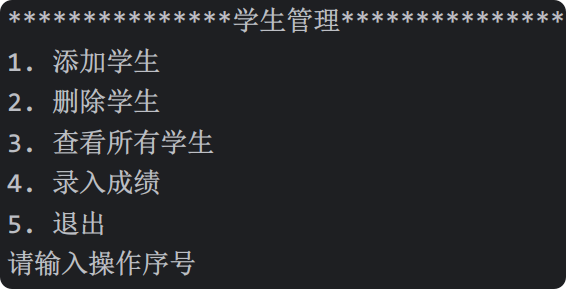

# 11. 小练习

完成一个学生成绩管理小案例



具体代码如下：

```
from datetime import datetime

# 定义Person类
class Person:
    def __init__(self, name, age, gender):
        self.name = name
        self.age = age
        self.gender = gender

class Student(Person):
    # 计数器
    count = 0

    def __init__(self, name, age, gender):
        super().__init__(name, age, gender)
        Student.count += 1
        # 给每个学生添加stu_id属性，格式为：年份-序号，序号靠计数器增长。
        self.stu_id = f'{datetime.now().year}{Student.count:03d}'
        # 给学生添加成绩，格式为： {'数学':90, '语文':80, '英语':70}
        self.scores = {}

    # 给当前学生添加成绩
    def add_score(self, subject, score):
        # 给指定学生添加成绩，subject是学科，score是成绩
        self.scores[subject] = score

    # 计算平均分
    def calcu_avg(self):
        if self.scores:
            # 计算平均成绩
            return sum(self.scores.values()) / len(self.scores)
        else:
            return 0

    # 魔法方法
    def __str__(self):
        return f'{self.name}({self.age}-{self.gender})，成绩：{self.scores}，平均分:{self.calcu_avg():.1f}'

class Manager:
    def __init__(self):
        self.stu_list = []

    # 添加学生
    def add_student(self):
        name = input('请输入姓名：')
        age = int(input('请输入年龄：'))
        gender = input('请输入性别：')
        # 创建学生实例对象
        stu = Student(name, age, gender)
        # 将当前学生添加到stu_list列表中
        self.stu_list.append(stu)
        print(f'添加成功！学号是：{stu.stu_id}')

    # 删除学生
    def del_student(self):
        sid = input('请输入学号：')
        # target用于保存要删除的学生
        target = None
        # 遍历所有学生，找到要删除的学生，并交给target变量
        for stu in self.stu_list:
            if stu.stu_id == sid:
                target = stu
        # 如果找到了要删除的学生，就调用remove方法移除该学生
        if target:
            self.stu_list.remove(target)
            print('删除成功！')
        # 如果未找到要删除的学生
        else:
            print('学号有误，删除失败！')

    # 展示所有学生
    def show_all_student(self):
        # 如果当前stu_list中有学生，就遍历展示
        if self.stu_list:
            for stu in self.stu_list:
                print(stu)
        # 如果当前stu_list中没有学生，就打印：暂无学生！
        else:
            print('暂无学生！')

    # 给指定学生设置成绩
    def set_score(self):
        sid = input('请输入学号：')
        # 遍历stu_list列表
        for stu in self.stu_list:
            # 如果当前学生学号，与输入的sid相等
            if stu.stu_id == sid:
                # 输入成绩字符串，格式为：学科-分数，学科-分数
                score_str = input('清输入成绩（学科-分数，学科-分数）')
                # 将输入的多个成绩，按照逗号拆分，形成成绩列表
                score_list = score_str.replace('，', ',').split(',')
                # 循环成绩列表，依次添加成绩
                for item in score_list:
                    # 获取科目与成绩
                    subject, score = item.split('-')
                    subject = subject.strip()
                    score = float(score.strip())
                    # 调用add_score方法，添加科目，成绩
                    stu.add_score(subject, score)
                print('添加成功！')
                # 结束循环，同时结束set_score函数
                return
        # 若程序能执行到此处，证明在stu_list中没有找到与sid对应的学生
        print('学号有误！')

    # 提供主菜单
    def run(self):
        while True:
            print('************学生管理************')
            print('1. 添加学生')
            print('2. 删除学生')
            print('3. 查看所有学生')
            print('4. 录入成绩')
            print('5. 退出')

            chocie = input('请输入操作编号：')
            if chocie == '1':
                self.add_student()
            elif chocie == '2':
                self.del_student()
            elif chocie == '3':
                self.show_all_student()
            elif chocie == '4':
                self.set_score()
            elif chocie == '5':
                print('再见！')
                break
            else:
                print('输入有误！')

m1 = Manager()
m1.run()
```
