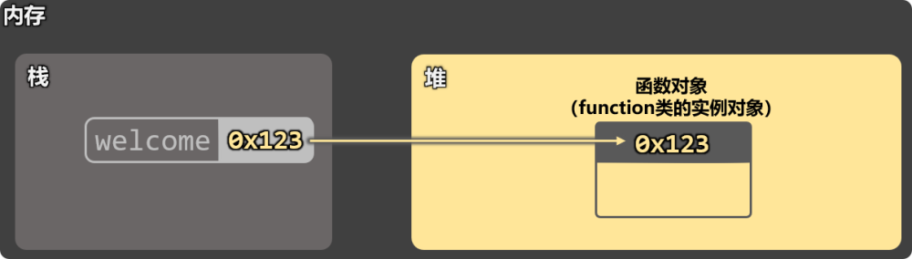
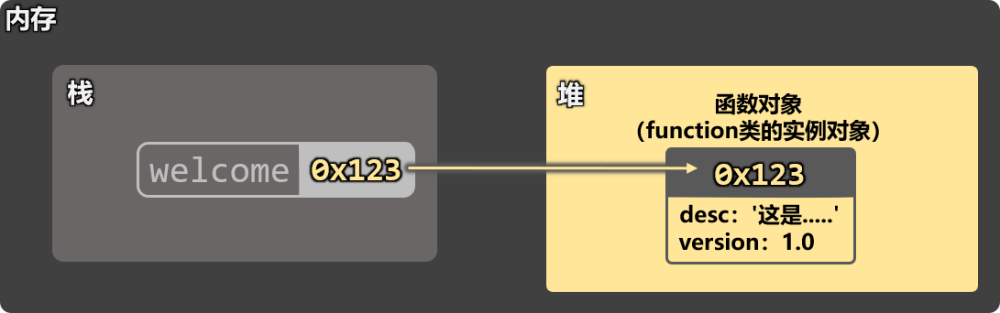
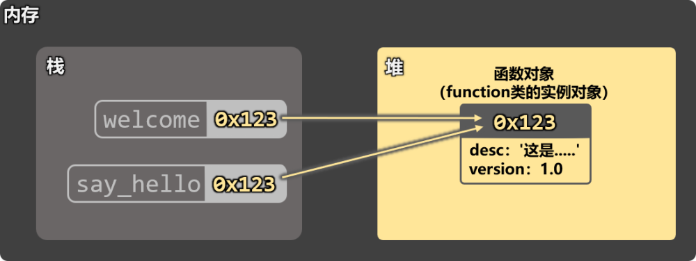

# 1. 重新认识函数

1️⃣函数也是对象。

```
a1 = 100            # a1是int类的实例对象
a2 = 'hello'        # a2是str类的实例对象
a3 = [10, 20, 30]   # a3是list类的实例对象

# welcome函数是function类的实例对象
def welcome():
    print('你好啊')

print(type(a1))
print(type(a2))
print(type(a3))
print(type(welcome))
```

上述代码中welcome函数的内存示意图：



2️⃣函数可以像对象一样，动态添加属性。

```
def welcome():
    print("你好")

# 动态添加属性
welcome.desc = "这是一个用于打招呼的函数"
welcome.version = 1.0
print(welcome.__dict__)

# 调用函数
welcome()
```



3️⃣函数可以赋值给变量。

```
def welcome():
    print('你好啊！')

# 把函数对象赋值给变量
say_hello = welcome

# 通过变量调用函数
say_hello()

# 通过函数名调用函数
welcome()
```

上述代码的内存结构示意图：



4️⃣可变参数 vs 不可变参数

```
def welcome(data):
    print(f'函数收到的data是：{data}，地址是：{id(data)}')
    data = 888
    print(f'被修改后的data是：{data}，地址是：{id(data)}')

a = 666
print(f'函数外侧a的值是：{a}，地址是：{id(a)}')
welcome(a)
print(f'函数调用后a的值是：{a}，地址是：{id(a)}')
def welcome(data):
    print(f'函数收到的data是：{data}，地址是：{id(data)}')
    data[2] = 99
    print(f'被修改后的data是：{data}，地址是：{id(data)}')

a = [10, 20, 30]
print(f'函数外侧a的值是：{a}，地址是：{id(a)}')
welcome(a)
print(f'函数调用后a的值是：{a}，地址是：{id(a)}')
```

5️⃣函数也可以作为参数

```
def welcome():
    print('你好啊！')

def caller(f):
    print('caller函数开始调用')
    f()

caller(welcome)
```

6️⃣函数也可以作为返回值

```
def welcome():
    print('你好啊')
    def show_msg(msg):
        print(msg)
    return show_msg

# result = welcome()
# result('尚硅谷')
welcome()('尚硅谷')
```
