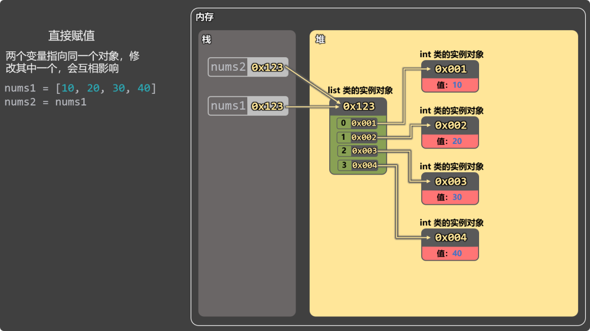
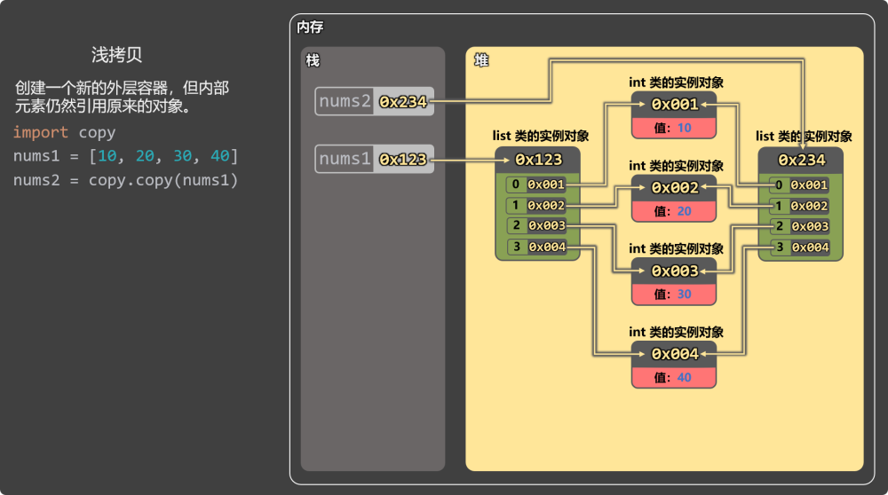
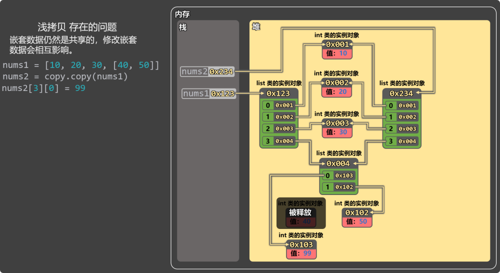
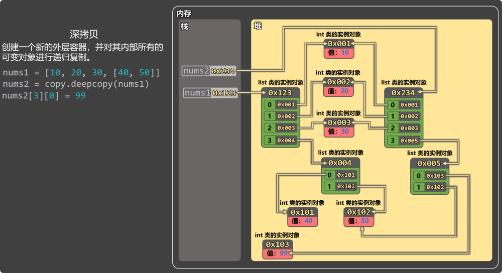

# 10. 浅拷贝 vs 深拷贝

## 10.1. 为什么要拷贝？

赋值语句：b = a ，只是让b 指向和 a 一样的对象。

如果a和b指向的是一个可变对象，那通过b修改后，再通过a访问到的数据也是变化后的。

## 10.2. 直接赋值

在如下代码中：nums2 = nums1 不是复制！是两个变量指向同一个列表，并且修改任何一个，都会影响另一个。

```
nums1 = [10, 20, 30, 40]
nums2 = nums1
nums2[3] = 99

print(nums1[3]) # 99
print(nums2[3]) # 99
```



## 10.3. 浅拷贝

浅拷贝会创建一个新的外层容器，但内部的元素仍然引用原来的对象。

```
import copy
nums1 = [10, 20, 30, 40]
nums2 = copy.copy(nums1)
nums2[3] = 99

print(nums1[3]) # 40
print(nums2[3]) # 99
```



浅拷贝存在的问题：嵌套数据仍然是共享的，修改嵌套数据会互相影响

```
import copy

nums1 = [10, 20, 30, [40, 50]]
nums2 = copy.copy(nums1)
nums2[3][0] = 99

print(nums1[3][0])
print(nums2[3][0])
```



## 10.4. 深拷贝

创建一个新的外层容器，同时对内部所有【可变对象】进行递归复制（不可变对象不复制，继续引用）。

```
import copy

nums1 = [10, 20, 30, [40, 50]]
nums2 = copy.deepcopy(nums1)
nums2[3][0] = 99

print(nums1[3][0])
print(nums2[3][0])
```



特点：

深拷贝可以彻底消除数据之间的相互影响。

深拷贝遇到【不可变对象】不会复制，会直接引用。

注意点：

深拷贝只复制可变对象，不可变对象会直接引用。

元组中如果只包含不可变对象，则深拷贝没有效果。

```
import copy
a = 666
# a是不可变对象，即便调用deepcopy也不会深拷贝，会直接引用
b = copy.deepcopy(a)

print(id(a))
print(id(b))
import copy
nums1 = (10, 20, 30, [40, 50])
# nums1元组中只包含不可变对象，即便调用deepcopy也不会深拷贝
nums2 = copy.deepcopy(nums1)

print(id(nums1))
print(id(nums2))
```
