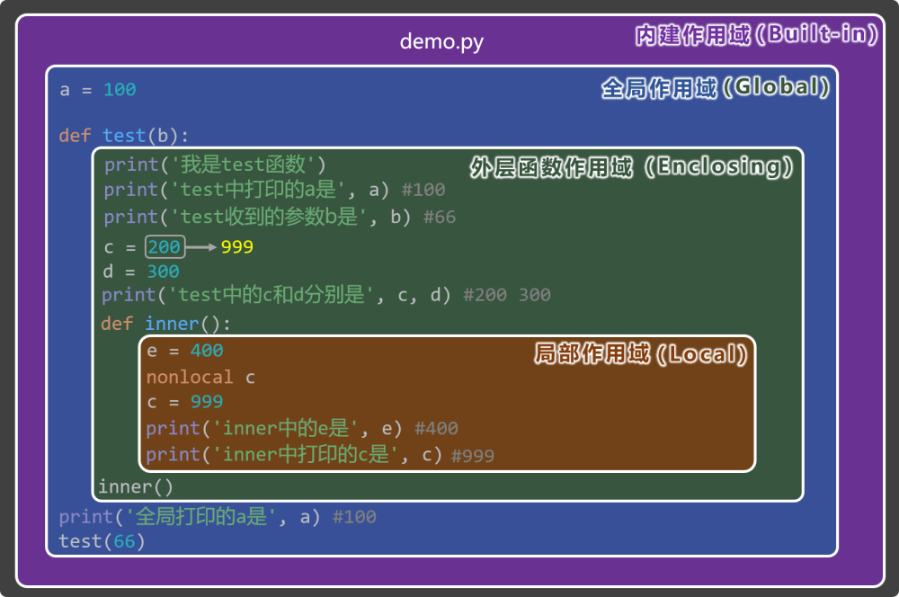

# 11. 四种作用域

Python 中有四种作用域，分别是：

Local（局部作用域）

Enclosing（外层作用域）

Global（全局作用域）

Built-in（内建作用域）

当访问一个变量时，Python 会按以下顺序查找： Local => Enclosing => Global => Built-in



上述图示的详细分析，请参考视频教程。

## 11.1. 局部作用域（Local）

定义：函数的内部就是局部作用域，局部作用域中的变量，只在该函数内部可见。

特点：

每次调用函数都会创建一个新的局部作用域。

函数运行结束后，局部作用域会随之销毁。

局部作用域优先级最高，即：查找一个变量时，Python 会首先在局部作用域中查找。

举例：

```
def test():
    x = 10  # x 在局部作用域
    print(x)  # 可以访问

print(x)  # ❌ 报错：x 在局部之外不可见
```

## 11.2. 外层作用域（Enclosing）

定义：如果函数中又定义了函数，那么外层函数的作用域，就是内层函数的 Enclosing 作用域。

特点：

只有当函数“嵌套定义”时才会出现。

内层函数可以读取外层函数变量。

想修改外层变量必须使用nonlocal。

举例：

```
def outer():
    y = 20  # outer 的局部变量 → inner 的 Enclosing 变量

    def inner():
        print(y)  # 内层函数读取外层变量

    inner()
```

修改外层变量：

```
def outer():
    y = 20
    def inner():
        nonlocal y
        y = 99  # 修改外层函数作用域变量
```

## 11.3. 全局作用域（Global）

定义：.py文件就是全局作用域，全局作用域中的变量，在当前.py文件的任何位置都可以访问。

特点：

全局变量只在当前.py文件中可见。

函数内部可以使用global关键字修改全局变量。

例子：

```
a = 100  # 全局变量

def test():
    print(a)  # 可以读取

test()
print(a)  # 在本文件任何位置都可以访问
```

如果要修改：

```
a = 100

def test():
    global a
    a = 200  # 修改全局变量
```

## 11.4. 内建作用域（Built-in）

定义：Python 预先定义好的东西，会放在内建作用域中，所有.py文件都可以直接使用。

特点：

所有.py文件都能直接使用其中的名称。

例如：print、len、range、sum、max 等。

查找优先级最低，即：查找一个变量时，内建作用域是“最后一道防线”。

例子：

```
print('hello') 
len([1, 2, 3])
```
