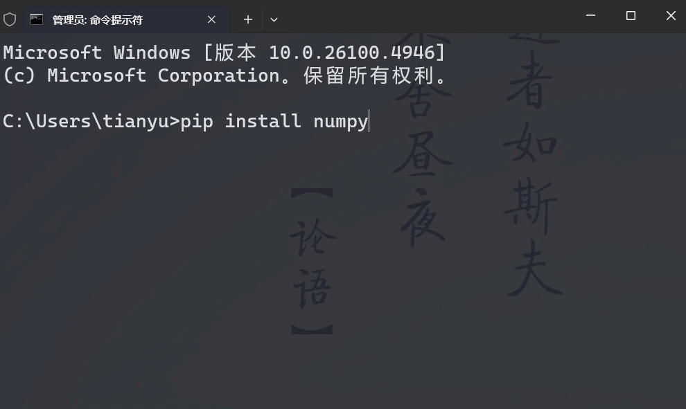
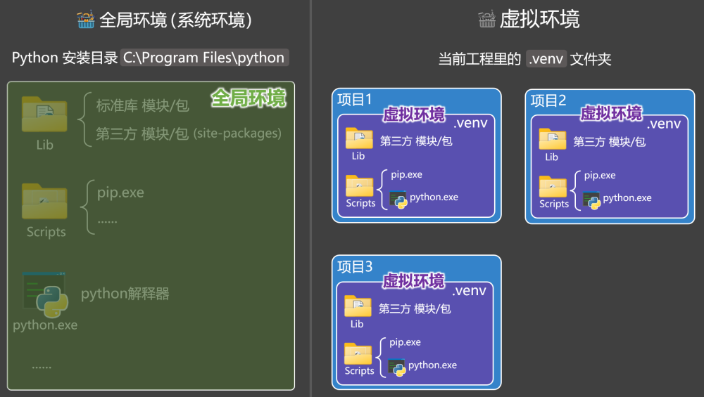
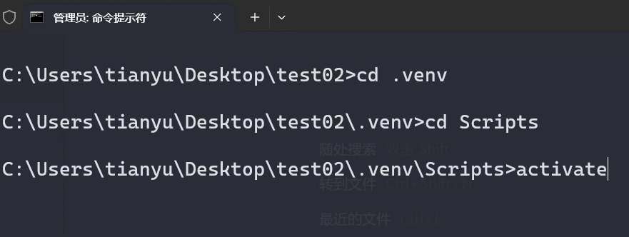

# 2. 包

## 2.1. 概述

包是一种组织模块的方式，包中可以包含：各种模块、子包、其他资源等。

在 Python 中，【包含__init__.py 的文件夹】就是一个包（Package）。

我们通常会把【某个特定功能相关的所有模块】放入一个包中。

使用包可以进一步提升代码的：可维护性、可复用性，便于管理大型项目。

## 2.2. 包与模块的关系

一个模块就是一个.py文件 ，包是用来“管理模块”的目录(文件夹)。

一个包中可以有多个模块，也可以有多个子包。

## 2.3. 包的分类

Python 中的包分为三类，分别是：标准库包、自定义包、第三方包。

## 2.4. 创建包

包命名注意点：

要符合标识符命名规范。

包名区分大小写（建议全部使用小写字母）

不要与标准库包同名。

创建如下文件结构，由于trade文件中包含了__init__.py文件，所以trade就可以称之为『包』。

```
└── trade/
    ├── __init__.py
    ├── order.py
    └── pay.py
```

各文件内容如下：

```
# 该文件暂时留白，不编写任何代码，后面会对该文件详细讲解
# 订单最大金额
max_order_amount = 1000000

# 创建订单
def create_order():
    print('订单创建成功！')

# 关闭订单
def cancel_order():
    print('订单关闭成功！')

# 提示函数
def show_info():
    print('我是来自【订单】模块的提示！')
# 支付超时时间
timeout = 1800

# 微信支付
def wechat_pay():
    print('我是微信支付！')

# 支付宝支付
def ali_pay():
    print('我是支付宝支付！')

# 提示函数
def show_info():
    print('我是来自【支付】模块的提示！')
```

## 2.5. 导入包

### 1️⃣import 包名.模块名

```
import trade.order
import trade.pay

trade.order.create_order()
trade.pay.wechat_pay()
```

### 2️⃣import 包名.模块名 as 别名

```
import trade.order as dd
import trade.pay as zf

dd.create_order()
zf.wechat_pay()
```

### 3️⃣from 包名.模块名 import 具体内容1

```
from trade.order import max_order_amount, create_order
from trade.pay import timeout, wechat_pay

print(max_order_amount)
print(timeout)
create_order()
wechat_pay()
```

### 4️⃣from 包名.模块名 import 具体内容 as 别名

```
from trade.order import max_order_amount as max_amt, create_order
from trade.pay import timeout, wechat_pay as w_pay

print(max_amt)
print(timeout)
create_order()
w_pay()
```

### 5️⃣from 包名.模块名 import *

```
from trade.order import *
from trade.pay import *

# print(max_order_amount)
create_order()
cancel_order()
show_info()

print(timeout)
wechat_pay()
ali_pay()
show_info()
```

### 6️⃣from 包名 import 模块名

```
from trade import order, pay

order.create_order()
pay.wechat_pay()
```

### 7️⃣from 包名 import 模块名 as 别名

```
from trade import order as dd, pay as p

dd.create_order()
p.wechat_pay()
```

### ⭐关于 __init__.py 文件

__init__.py 是包的初始化文件，在包被导入时，__init__.py 会被自动调用

__init__.py 中可以编写一些包的初始化逻辑

__init__.py 中所定义的内容，会被 from 包名 import * 形式全部引入

__init__.py 中也可以使用 __all__ 来控制包中的哪些模块可以被from 包名 import *引入

### 8️⃣from 包名 import *

```
from trade import *

# print(a)
# print(b)
print(order.max_order_amount)
order.create_order()
print(pay.timeout)
pay.wechat_pay()
```

### 9️⃣import 包名

注意：想通过import 包名形式进行引入，就必须在__init__.py中定义好具体的内容

```
import trade

print(trade.a)
print(trade.b)
trade.order.create_order()
trade.pay.wechat_pay()
```

## 2.6. 引入子包

以上引入方式，都可以用于引入子包，只需要在包名的后面跟上子包名即可，

在trade包中创建一个子包hello，其中包含h1模块：

```
└── trade/
    └── hello/
         ├── __init__.py
         └── h1.py
    ├── __init__.py
    ├── order.py
    └── pay.py
    └── demo.py
```

h1模块内容如下：

```
def say_hello():
    print('你好')
```

例如：

```
from trade.hello.h1 import say_hello

say_hello()
```

## 2.7. 第三方包

### 1️⃣概述

PyPI 是是 Python 官方推荐、官方维护的包发布与分发平台（https://pypi.org）

pip是Python包管理工具，该工具提供了对 Python 包的查找、下载、安装、卸载的功能。

```
pip 默认的源是 PyPI，其地址为 ，如果下载比较慢，还可以指定其它的源。
```

备注：以下网址不推荐在浏览器中访问，正确用法是结合命令去使用（后面有讲解）

清华大学： https://pypi.tuna.tsinghua.edu.cn/simple

阿里云： https://mirrors.aliyun.com/pypi/simple

中国科技大学： https://pypi.mirrors.ustc.edu.cn/simple

### 2️⃣pip常用命令

| 命令 | 说明 |
| --- | --- |
| pip install 包名 | 安装指定的包。 |
| pip install -i 镜像地址 包名 | 临时使用镜像地址安装指定包。 |
| pip config set global.index-url 地址 | 设置 pip 所使用的镜像地址。 |
| pip config list | 查看当前环境的 pip 配置。 |
| pip config unset global.index-url | 让 pip 恢复使用官方默认的地址。 |
| pip list | 列出当前环境中，已安装的所有第三方包。 |
| pip uninstall 包名 | 从当前环境中卸载指定的第三方包。 |

### 3️⃣安装一个第三方包

以安装numpy包为例（注意：请务必使用管理员身份运行 cmd）



💡思考：numpy安装到哪里去了呢？ ———— 全局环境

### 4️⃣全局环境 vs 虚拟环境

什么是环境？ —— 所谓环境就是指：python 解释器 + 依赖包。

Python 环境分类两种，分别是全局环境（系统环境）、虚拟环境。

所有项目共用全局环境容易互相影响和干扰，虚拟环境可以解决这个问题，二者结构如下图：

图中的 Python 安装目录中的文件，构成了全局环境（系统环境）。

图中的.venv中的文件构成了虚拟环境。

虚拟环境有自己独立的一套：Python 解释器、pip 命令、第三方依赖包，不和其它项目产生干扰。

虚拟环境和全局环境共用的东西，只有标准库。



在cmd中不做任何处理，直接通过pip安装的包，都是安装在了全局环境中，如果想在虚拟环境中安装包，需要切到虚拟环境目录后，通过activate命令切换到虚拟环境。

备注：使用deactivate可以退出虚拟环境。


