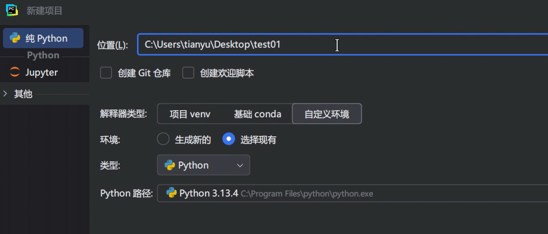

# 3. 创建全局环境项目

通过 Pycharm 创建项目时，进行如下配置，即可创建全局环境：



在全局环境中安装好这两个包：numpy、pyfiglet，随后进行测试：

```
# 使用安装在全局环境中的第三方包numpy
import numpy as np
result = np.random.randint(10, 100, size=10)
print(result)
print(type(result))
print(result.max())
print(result.min())

# 使用安装在全局环境中的第三方包pyfiglet
from pyfiglet import figlet_format
result = figlet_format('hello')
print(result)

# 使用全局的标准库
from collections import Counter
list1 = [10, 20, 30, 40, 20, 30, 20, 30, 10, 10, 10]
res = Counter(list1)
print(res)
```

结论：基于全局环境的项目，可以使用：全局环境中的第三方包，也可以使用全局的标准库。
