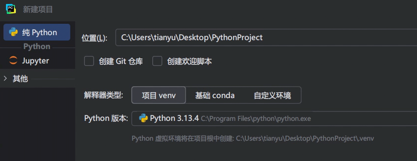
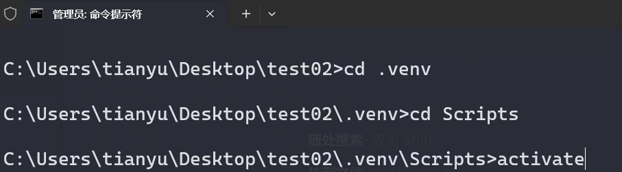
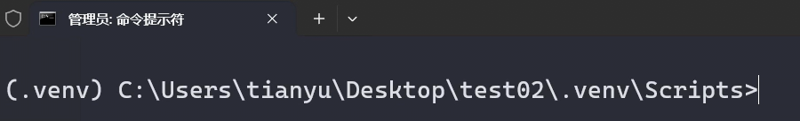
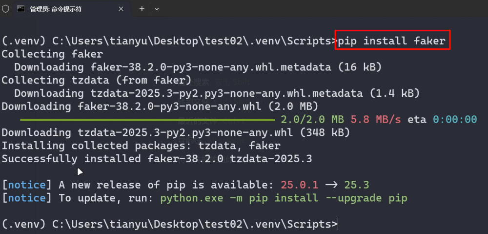
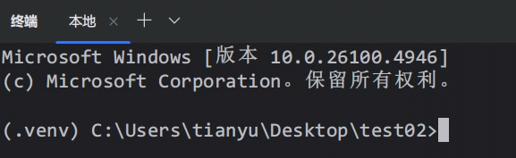
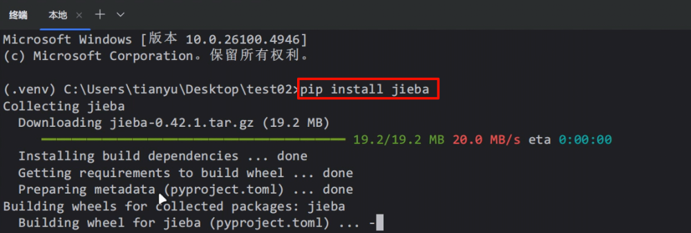
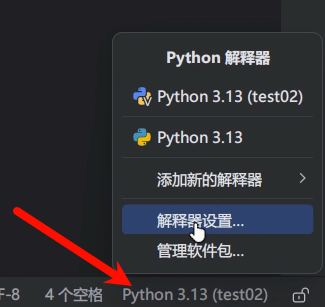
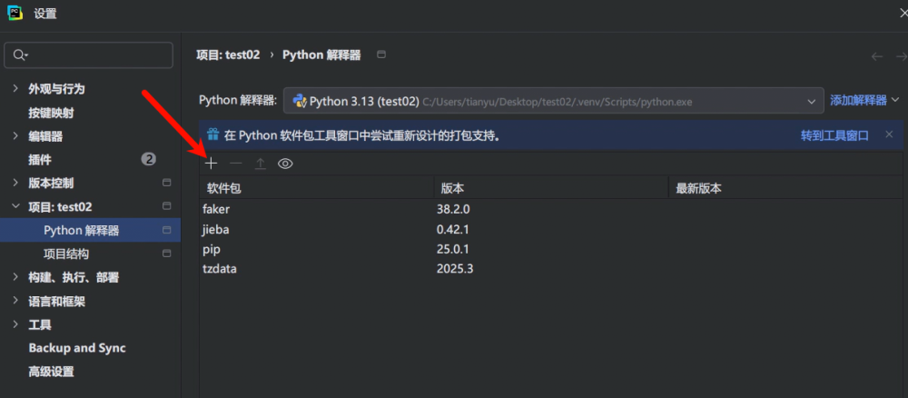
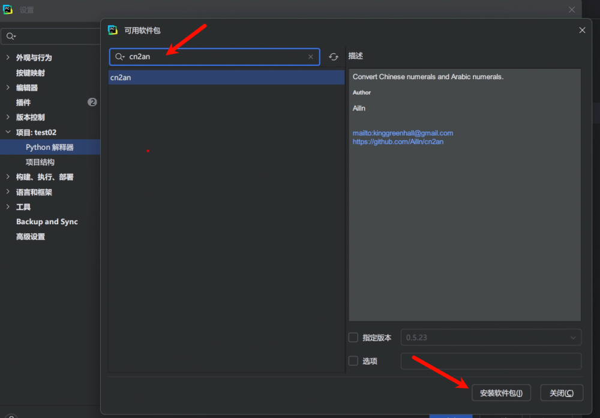

# 4. 创建虚拟环境项目

通过 Pycharm 创建项目时，进行如下配置，即可创建虚拟环境：



给虚拟环境安装第三方包的方式有三种：

1️⃣通过 cmd 安装

先切换到虚拟环境



随后会切换到虚拟环境



随后安装自己想要的包（例如：faker）



2️⃣通过 Pycharm 中的命令行窗口安装

在 Pycharm 中打开命令行，会自动激活当前目录的虚拟环境



随后安装自己想要的包（例如：jieba）



3️⃣通过 Pycharm 提供的可视化工具安装

点击 Pycharm 右下角，随后选择解析器设置



随后点击加号



在搜索框里输入自己想安装的包（例如：cn2an），随后点击安装即可



测试使用虚拟环境的第三方包

```
# 使用安装在当前虚拟环境中的第三方包faker
from faker import Faker
f = Faker('zh_CN')
print(f.name())
print(f.address())
print(f.phone_number())

# 使用安装在当前虚拟环境中的第三方包jieba
import jieba
result = jieba.lcut('南京市长江大桥')
print(result)

# 使用安装在当前虚拟环境中的第三方包cn2an
import cn2an
print(cn2an.cn2an('九千七百四十三'))


# 使用全局的标准库
from collections import Counter
list1 = [10, 20, 30, 40, 20, 30, 20, 30, 10, 10, 10]
res = Counter(list1)
print(res)
```

结论：基于虚拟环境的项目，可以使用：虚拟环境中的第三方包，也可以使用全局的标准库。
