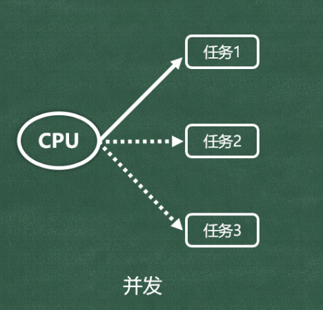
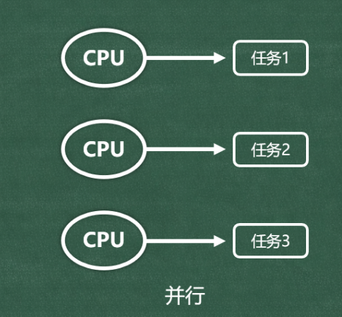

# 1. 一些核心概念

## 1️⃣并发 vs 并行

并发：

🔸概念：在一段时间内，当 CPU 面对多个任务时，会将每个任务交替着执行一段时间。

🔸特点：

(1). 对于某个瞬间，CPU实际上只在执行一个任务。

(2). CPU通过高频切换不同的任务，让每个任务都能得到推进，仿佛多个任务在“同时执行”。

并行：

🔸概念：并行依赖于多个CPU，或多核心的CPU，在同一时刻，每个核心都在执行不同的任务

🔸特点：

(1). 对于某个瞬间，每个CPU（或每个核心）都在执行不同的任务。

(2). 通过多个CPU（或多个核心）同时工作的方式，让多个任务真的在同时执行。

注意：现代操作系统中，并发与并行通常同时存在。

## 2️⃣ 同步 vs 异步

同步(sync)：

🔸概念：发起一个任务之后，需要等该任务完成后，才能继续执行后续任务。

🔸表现：当前执行流会被『阻塞』。

异步(async)：

🔸概念：发起一个任务之后，不必等该任务完成，就可以继续执行其他任务。

🔸备注：虽然不必等待任务完成，但任务完成后，仍然可以通过特定方式获取结果。

🔸表现：当前执行流不会被『阻塞』。

概念对比：

并发 / 并行：描述的是任务如何被执行，即：多个任务在执行时，CPU 要如何处理。

同步 / 异步：描述的是任务如何被组织和等待，即：是否等当前任务执行完，再进行下一个任务。

⚠️注意点：

CPU 的核心数和执行速度，不会改变任务之间的逻辑依赖关系！例如：一旦任务1、任务2、任务3 之间被设计为同步关系，那么：即便 CPU 切换任务的速度再快，核心数量再多，也不会在【任务1】没完成的情况下去启动【任务2】

## 3️⃣进程 vs 线程

进程：

🔸一个正在运行的程序或软件，背后就对应着一个或多个进程。

🔸进程是操作系统进行资源分配的基本单位。

🔸每个进程都有自己独立的一块内存空间。

线程：

🔸线程是进程内部的执行单元（一个进程中可以有多个线程）。

🔸线程是操作系统进行 CPU 调度的基本单位。

🔸同一进程内的线程共享进程资源。
