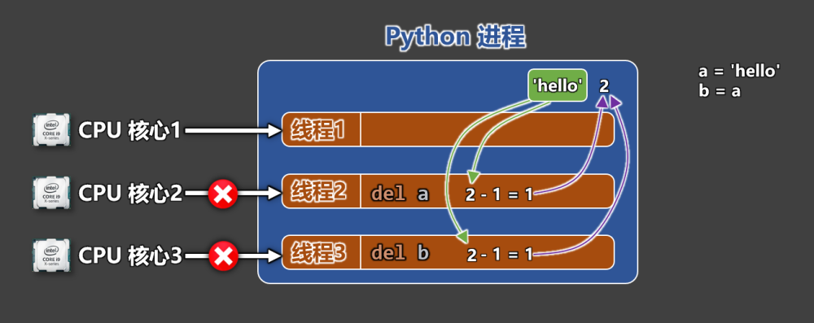
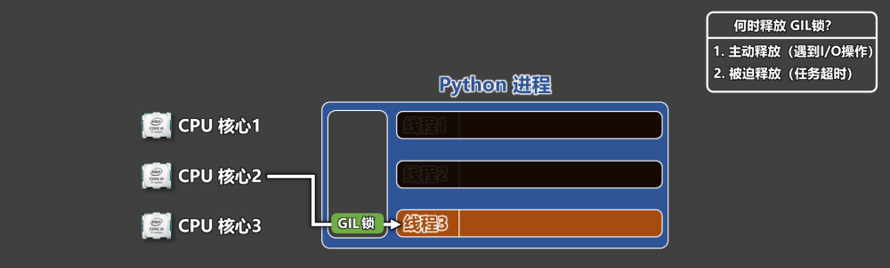
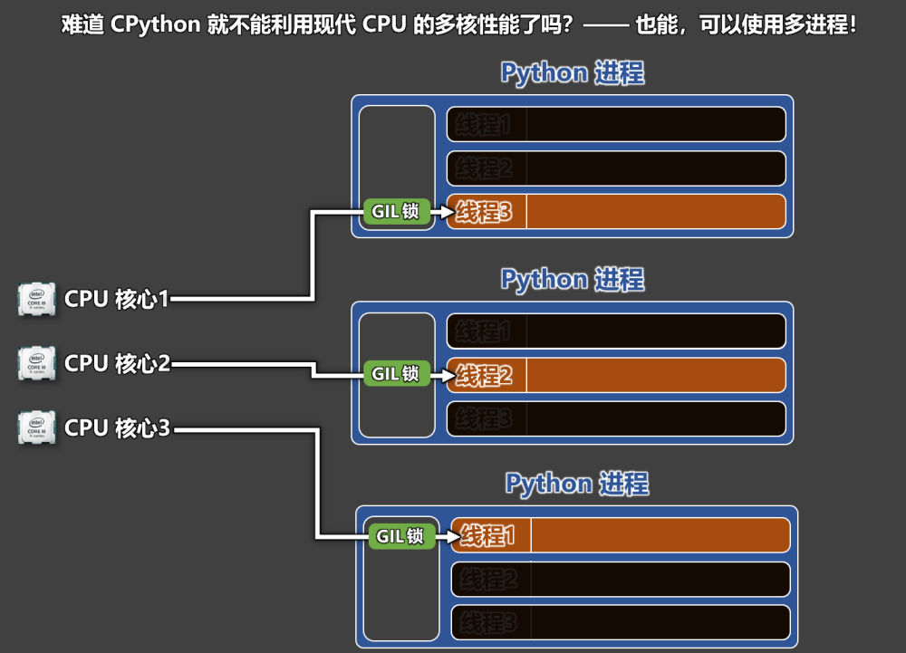
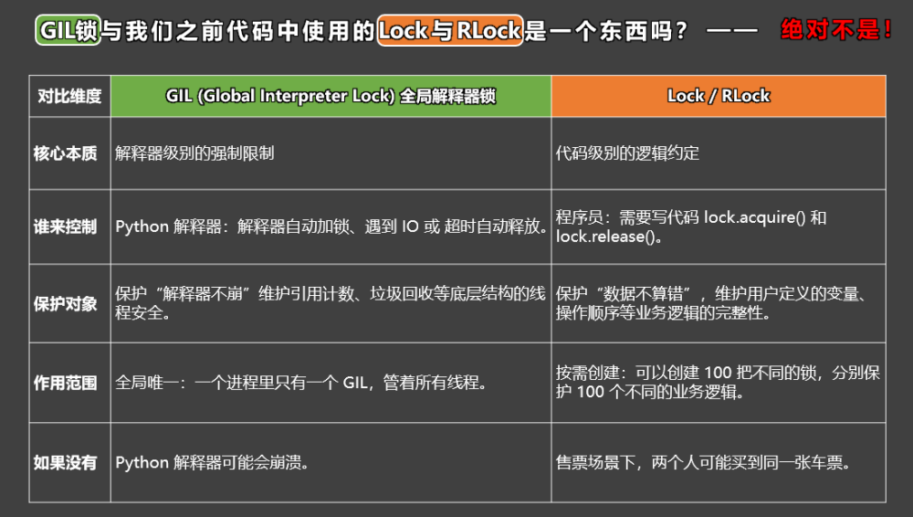

# 15. GIL 全局解释器锁

概念： GIL锁是 CPython 解释器中的一把互斥锁。

作用：无论 CPU 有多少个核心，在某一时刻，只允许同一个进程中的一个线程去执行 Python 代码。

结论：CPython 解释器中的多线程模型，本质上是并发，而不是并行！（是快速切换，而不是同时进行）

为何要这样设计？———— 为了确保解释器级别的数据安全。

如果没有 GIL 锁，那么 Python 底层就可能会出现引用计数错误，导致内存“爆炸”。



GIl 锁何时会被释放？ —— 主动释放（遇到 I/O 操作）、被迫释放（任务超时）



可以使用多进程来发挥多核 CPU 的性能



GIL 对比 lock/Rlock：



结论：GIL 为了确保 Cpython 解释器级别的数据安全，作为日常编码来说，我们对 GIL 是无感的，但对于 Lock/Rlock 是实际编码中使用较多的，Lock/Rlock是为了确保业务路基的完整，例如：

```
# GIL锁和编码时使用的 Lock 和 Rlock 不是同一个东西。
# Lock 和 Rlock是业务层面的锁，目标是：让业务逻辑别出错
# Rlock示例1：让打印是完整的

import time
from threading import Thread, RLock,current_thread
def show_info1(lock):
    for index in range(10):
        with lock:
            print('尚', end='')
            print('硅', end='')
            print('谷')

def show_info2(lock):
    for index in range(10):
        with lock:
            print('at', end='')
            print('gui', end='')
            print('gu')

if __name__ == '__main__':
    lock = RLock()
    t1 = Thread(target=show_info1, args=(lock,))
    t2 = Thread(target=show_info2, args=(lock,))
    t1.start()
    t2.start()

# Rlock示例2：不要让两个窗口卖出同一张票
current = 1

def sale(lock):
    global current
    while True:
        with lock:
            if current <= 20:
                print(f'{current_thread().name}出售了第{current}张票！')
                current += 1
            else:
                print('票已售空')
                break
        time.sleep(0.3)

if __name__ == '__main__':
    lock = RLock()
    t1 = Thread(target=sale, name='窗口1', args=(lock,))
    t2 = Thread(target=sale, name='窗口2', args=(lock,))
    t3 = Thread(target=sale, name='窗口3', args=(lock,))
    t1.start()
    t2.start()
    t3.start()
```
