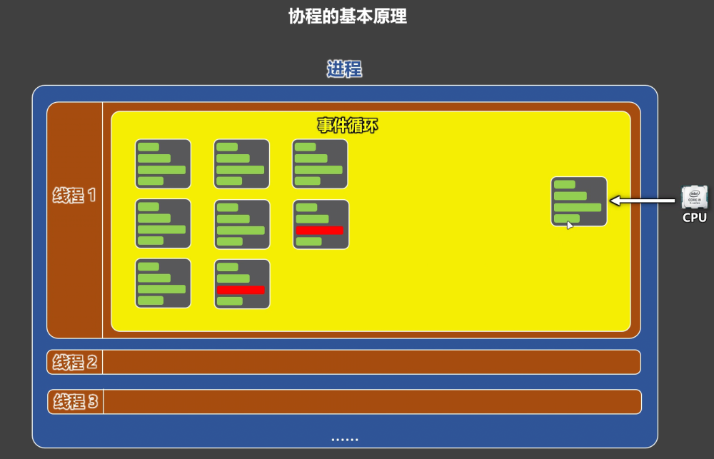

# 1. 什么是协程

概念：协程（Coroutine），是一种线程内部的任务调度机制，它通过事件循环，在用户态中实现任务的挂起与恢复执行，从而在遇到 IO 操作时，不让 CPU 等待，而是继续执行其它需要 CPU 的任务。

协程的本质就是：在一个线程里，趁着某些任务在等 IO，把 CPU 交给其它任务去用。

关键点1️⃣：协程不是线程，也不是进程

协程不是操作系统提供的，并且 CPU 看不见协程。

操作系统不知道协程的存在。

协程是程序员在用户态，用代码“设计出来”的任务切换机制。

关键点2️⃣：协程发生在一个线程内部

协程不是线程之间的切换。

而是线程内部多个任务之间的切换。

本质是一个线程里，写了很多任务，由事件循环统一调度。

关键点3️⃣：协程的核心能力：挂起与恢复

当任务 遇到 IO 操作 时：任务会被挂起。

当 IO 操作完成后：任务会被恢复执行。

关键点4️⃣：协程依赖一个关键角色：事件循环

事件循环负责：调度任务、判断是否该挂起、决定何时恢复执行，事件循环是协程系统的“大脑”

关键点5️⃣：协程的目标是尽量减少线程切换

在单线程场景下，最大化 CPU 利用率，特别适合 IO 密集型任务
